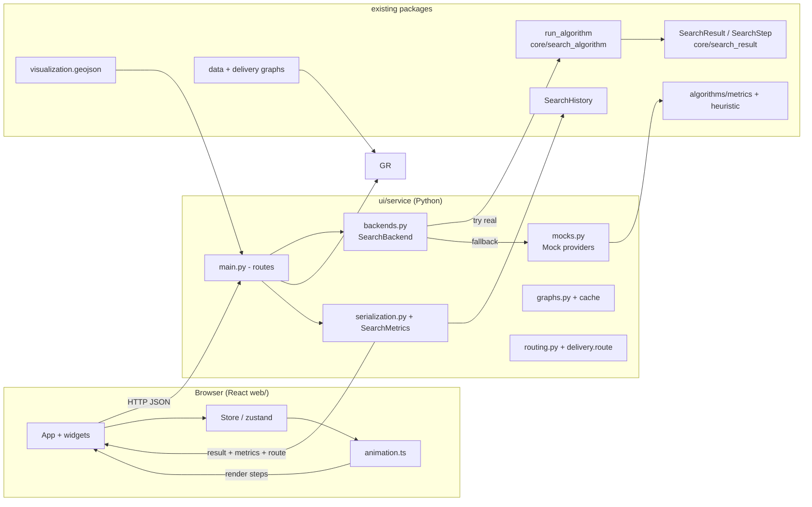
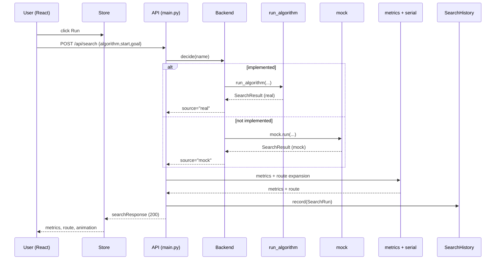
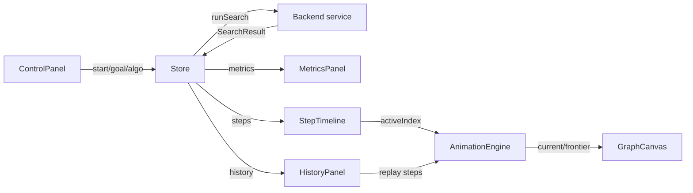
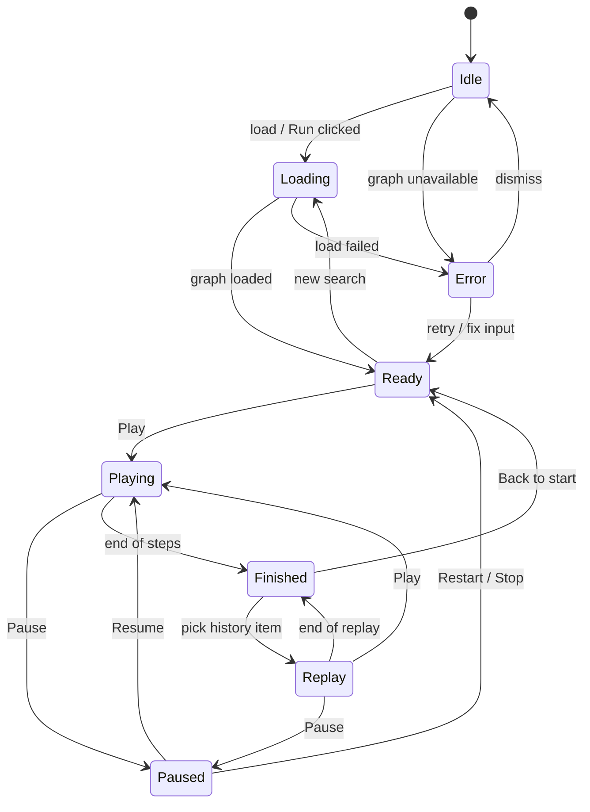

# GUI_ROADMAP.md

**HCMC Delivery AI Search - GUI Implementation Roadmap**

Version: 2.0

Owner: Hưng

Scope: a complete, algorithm-agnostic GUI that works **today** using only the existing
architecture and public interfaces. BFS is real today; DFS/UCS/Greedy/A*/Dijkstra/IDA*
are teammates' work. The GUI runs those algorithms via mock `SearchResult` objects and
requires **zero edits** once the real algorithms land.

Companion docs: `docs/ARCHITECTURE.md` (dependency flow), `docs/MAP_CONTRACT.md`
(JSON contracts), `ALGORITHM_SPEC.md`, `CONVENTION.md`.

> This revision (2.0) preserves every decision, API, ownership boundary, implementation
> phase, and phase-1/2/3/4 objective of the approved 1.0. Sections were only renumbered and
> extended with diagrams, API contracts, state machine, error handling, testing, ownership,
> versioning, conventions, performance budgets, and milestone-sized tasks.

---

## 1. Goals & hard rules

- No redesign of the architecture; no public API changes.
- The GUI depends **only** on the abstractions already provided (`run_algorithm`,
  `SearchResult`, `SearchStep`, `SearchHistory`, `SearchMetrics`, `GraphLike`,
  `visualization.geojson`, `delivery.route.expand_poi_path`).
- The GUI must **not** special-case BFS. Any name that is not yet implemented falls back to
  a generic mock; the frontend never branches on a concrete algorithm name.
- Once a teammate finishes DFS/UCS/Greedy/A*/… , the GUI must work **with zero code edits**.

---

## 2. Architecture analysis (GUI ↔ core)

| Component | Location | GUI contract |
|---|---|---|
| Graph | `data.loader` + `delivery.loader` | `DeliveryGraph` (`.nodes`/`.edges`) served as GeoJSON via `visualization.geojson`; `RoadGraph` for expansion |
| SearchAlgorithm / registry | `core/search_algorithm.py` | GUI never calls it; the Python service calls `run_algorithm(name, graph, start, goal, **kwargs)` |
| SearchResult | `core/search_result.py` | `path`, `visited_nodes`, `steps`, `total_distance_km`, `total_time_min`, `total_cost`, `processing_time_ms`, `explanation` |
| SearchStep | `core/search_result.py` | `current_node`, `frontier`, `reason` — the **only** animation input |
| SearchHistory | `core/search_history.py` | `SearchRun(algorithm, start, goal, result)`; `SearchHistory.record/recent/clear` |
| Metrics | `core/search_metrics.py` | `SearchMetrics.from_result` derived **from the SearchResult** |

**Coupling rule:** the frontend only ever receives *SearchResult JSON* and *graph/GeoJSON*.
It never imports `algorithms.*`, never calls `run_algorithm`, never branches on a name.

---

## 3. Diagrams

### 3.1 High-level component diagram



### 3.2 Request / response sequence (one search run)



### 3.3 Data flow: GUI → backend → SearchResult → UI

```mermaid
flowchart LR
    DG[delivery_graph.json] --> GR[graph + GeoJSON]
    IN[start/goal/algorithm] --> S[POST /api/search]
    S --> B[Backend real|mock]
    B --> R[SearchResult\nsteps]
    R --> MET[SearchMetrics] --> MP[MetricsPanel]
    R --> RT[expanded route] --> CV[GraphCanvas]
    R --> AN[Animation engine\nper SearchStep] --> TL[StepTimeline + Canvas]
    R --> H[SearchHistory] --> HP[HistoryPanel]
```

### 3.4 Component interaction (GraphCanvas / ControlPanel / Timeline / Animation / Store / Backend)



- **GraphCanvas** renders `geojson`; subscribes to `animation.current`/`frontier`.
- **ControlPanel** writes `search.*`, triggers `runSearch()`.
- **StepTimeline** reads `result.steps.length`, writes `animation.activeIndex`.
- **AnimationEngine** is a pure reducer over steps → frame; no algorithm name.
- **Store** is the single source of truth for all slices.
- **Backend (service)** converts `SearchResult` → metrics + route; never touches the DOM.

---

## 4. GUI architecture (folder structure & SOC)

```
ui/
  service/                  # Python JSON service (the backend)
    __init__.py
    main.py                 # app entrypoint, routes
    backends.py             # AlgorithmCatalog + SearchBackend (real -> mock fallback)
    mocks.py                # DFS / UCS / Greedy / A* mock providers
    graphs.py               # graph loading + caching + GeoJSON serving
    routing.py              # run -> SearchResult -> expanded route
    serialization.py        # SearchResult -> MAP_CONTRACT JSON
    errors.py               # typed errors + HTTP mapping
  web/                      # React frontend
    package.json
    src/
      main.tsx
      App.tsx               # fetch wrappers (no algorithm logic)
      state/store.ts        # Zustand
      api/client.ts         # typed fetch client + error envelope
      services/animation.ts # pure SearchStep consumer
      components/
        GraphCanvas/
        Sidebar/
        ControlPanel/
        StepTimeline/
        MetricsPanel/
        HistoryPanel/
    index.html
```

### Separation of concerns

| Layer | Owns | Never owns |
|---|---|---|
| `service.backends` | algorithm catalogue, real/mock resolution, naming | algorithm logic / animation |
| `service.mocks` | mock SearchResult generation | real algorithms |
| `service.routing` | graph → expanded route | algorithm names |
| `service.errors` | exception → HTTP error envelope | algorithm names |
| `web/state` | UI state + selection | HTTP/algorithms |
| `web/services/animation` | steps → draw | algorithm identity |
| `web/components` | render + widgets | algorithm logic |

### State (single store)

```
graph        : { geojsonNodes, geojsonEdges, bbox }
search       : { selectedAlgorithm, start, goal, result, source: "real"|"mock" }
animation    : { activeIndex, playing, speed, status }
metrics      : { hops, nodesVisited, distance, time, cost, ms }
history       : { runs[] }
ui           : { panelOpen, selectedNode, hoveredStep }
```

Only `source` distinguishes mock from real — set by the service, never inferred.

`metrics` fields are derived from `result` (`SearchMetrics.from_result`, §2); the store caches
them for display. `ui` is the GUI-only slice and may grow additive fields (e.g. `route`, theme,
toasts) without changing the contract.

### Rendering pipeline

```
load graph ─► GraphCanvas (nodes + edges)
select start/goal/algo ─► POST /api/search
  service: run_algorithm | mock ─► SearchResult ─► metrics + expanded route
  ─► store.update
  steps[i] ─► animator (current + frontier) + StepTimeline
replay history: hydrate steps -> same animator
```

---

## 5. Buildable now (phase split)

**Phase 1 — Completely independent (no algorithm requested)**
Service graph loader + `/graph` + React `GraphCanvas` + store graph slice. Renders the
delivery graph with **zero** `algorithms.*`.

**Phase 2 — Depends only on BFS**
`routing.py` + `serialization.py` + `backends.py` (search); ControlPanel,
AlgorithmSelector(BFS), `animation.ts`, `StepTimeline`, `HistoryPanel`. The neutral pipeline
works because BFS is a real algorithm.

**Phase 3 — Uses mock algorithms**
`mocks.py` + fallback in `backends.py`. Selector lists name features with a `(mô phỏng)` tag.
No frontend change — frontend only consumes a `SearchResult`.

**Phase 4 — Ready for teammate merge**
`backends.py` dynamic load of `algorithms/<name>`; the real→mock handoff must never fire when
a teammate's real code is present; verified with a fake-teammate test.

---

## 6. Mock data design

```python
# ui/service/mocks.py
class MockProvider(Protocol):
    name: str
    def run(graph, start, goal, enable_logging=True) -> SearchResult: ...

MOCKS: dict[str, MockProvider] = {
    "dfs": DFSMock, "ucs": UCSMock, "greedy": GreedyMock, "astar": AstarMock,
}
```

Mock contract (must match the model exactly):

- `result.path[0] == start`, `result.path[-1] == goal`.
- `steps[i].current_node == result.visited_nodes[i]`, `len(steps) == len(visited_nodes)`.
- `total_distance_km`/`total_time_min`/`total_cost` computed from the **mock's chosen path**
  via `algorithms.metrics` on the real graph (no arbitrary numbers).
- `enable_logging=False` → `steps == []`.
- Deterministic for a fixed graph (no `random`/`time`/nonce).
- `explanation` is a simulated (Vietnamese) string with an `(mô phỏng)` marker so a mock is
  never confused with real output.

**Illustrative outputs on the BFS micro-graph (`A,B,C,D,E`; edges `A→B, A→C, B→D, C→E, D→E`):**

| Algorithm | mock path | visited order | rationale |
|---|---|---|---|
| BFS (real) | `A,C,E` | `A,B,C,D,E` | fewest hops |
| DFS | `A,B,D,E` | `A,B,D,E` | depth-first |
| UCS | `A,B,D,E` | `A,B,C,D,E` | min cost (3.0) |
| Greedy | `A,C,E` | `A,C,E` | next best to goal |
| A* | `A,B,D,E` | `A,B,D,E` | lowest f |

**Mock JSON (UCS on micro-graph):**

```json
{
  "path": ["A","B","D","E"],
  "visited_nodes": ["A","B","C","D","E"],
  "steps": [
    {"current_node": "A", "frontier": ["B","C"], "reason": "..."},
    {"current_node": "B", "frontier": ["C","D"], "reason": "..."},
    {"current_node": "C", "frontier": ["D","E"], "reason": "..."},
    {"current_node": "D", "frontier": ["E"], "reason": "..."},
    {"current_node": "E", "frontier": [], "reason": "..."}
  ],
  "total_distance_km": 3.0,
  "total_time_min": 3.0,
  "total_cost": 2.7,
  "processing_time_ms": 1.0,
  "explanation": "UCS - mô phỏng: chọn đường theo chi phí cộng dồn. ..."
}
```

### 6.1 Deterministic behavior

- Each mock is a pure function (graph, start, goal) → SearchResult; no side effects.
- Build adjacency in the **same edge order** as `run_algorithm("bfs", ...)` so frontier order
  is stable and reproducible across runs and tests.
- Break ties explicitly and deterministically (e.g., equal-cost neighbors in the order they
  appear in adjacency; never random).

### 6.2 Frontier generation

- One `SearchStep` per expanded node (same cadence as BFS). `frontier` is the algorithm's own
  open set at that instant, in algorithm-specific order:
  - DFS: the LIFO stack contents (after pop).
  - UCS: the priority queue contents (cost-ordered).
  - Greedy/A*: the open set after popping the best `h`/`f` node.
- Re-seen nodes never re-enter the frontier.

### 6.3 `processing_time_ms`

- Mock does not measure real time; it uses a deterministic small value derived from step count
  (e.g. `round(0.8 * (len(steps) + 1), 3)`), always `>= 0`, 3-decimal float.

### 6.4 Explanation format

- Vietnamese. MUST contain `(mô phỏng)`.
- Template: `"{Name} - mô phỏng: chọn đường " + " → ".join(path) + " (n bước). " + <rule reason>`.
- The trailing sentence states the rule used (stack / min-cost / heuristic), so it is clearly
  not the real result.

### 6.5 Metrics derivation

- Distance/time via `algorithms.metrics.path_metrics(graph, path, edge_lookup)`.
- Cost via `path_total_cost(graph, path, cost_fn=edge_cost)`.
- `hops = len(path) - 1`; `nodes_visited = len(visited_nodes)`; `processing_time_ms` from §6.3.
- If `start == goal`, all metrics are `0.0` and `visited_nodes = [start]`.

### 6.6 Invariants (must be test-covered)

- `path[0] == start` and `path[-1] == goal` (or `path == []` when unreachable).
- `steps[i].current_node == visited_nodes[i]`, equal lengths.
- Last frontier is empty at the final step.
- `total_distance_km == path_metrics(...)[0]`; time/cost likewise back-calculated.
- `enable_logging=False ⇒ steps == []`, path/metrics unchanged.
- All numeric fields are `>= 0` numbers (never `None`).

---

## 7. Error handling

All errors travel as a JSON envelope (never raw strings/HTML).

**Envelope**

```json
{ "error": { "code": "INVALID_INPUT", "message": "Start node 'X' not found.",
             "details": { "start": "X" } } }
```

**Codes mapped to status codes**

| code | HTTP | when |
|---|---|---|
| `GRAPH_NOT_FOUND` | 503 | graph files missing/failed to load |
| `ALGORITHM_UNKNOWN` | 404 | name not in catalog |
| `ALGORITHM_UNAVAILABLE` | 409 | real path raises and no mock exists |
| `INVALID_INPUT` | 400 | bad body / unknown start/ goal / malformed shape |
| `SEARCH_FAILED` | 500 | unexpected backend exception |
| `SEARCH_TIMEOUT` | 504 | exceeded `SEARCH_TIMEOUT_MS` |
| `INTERNAL` | 500 | unknown failure |
| `NOT_FOUND` | 404 | unknown run id in `GET /history/:id` |

**Failure handling**

- **Graph loading** → caught at startup; `GET /graph` returns 503; frontend lands on the
  `Empty`/`Error` state with a retry button (up to 3 tries), else `Error`.
- **Search failure** → `POST /search` returns envelope; frontend transitions the state-machine to `Error`.
- **Backend exception** → wrapped with `SEARCH_FAILED, logged with message; never leaks stack.
- **Invalid user input** → client-side validation first, plus server `INVALID_INPUT`; field-level
  message shown in the ControlPanel.
- **Timeout** → service enforces `SEARCH_TIMEOUT_MS` (default 5 000); maps to `SEARCH_TIMEOUT`.
- **Retry** → only GET endpoints may be retried (with `Retry-After`); `POST /search` is
  user-initiated, never auto-retried.
- **Empty states** (all screens have one):
  * canvas while loading → "Đang tải bản đồ";
  * Run disabled with "Chưa chọn điểm" until start/goal are set;
  * unreachable result (`path == []`) → metrics cloverbox "Không thể đi đến đích";
  * empty history → "Chưa có lần tìm kiếm nào".

---

## 8. GUI state machine

States: `Idle`, `Loading`, `Ready`, `Playing`, `Paused`, `Finished`, `Error`, `Replay`.



Rules:

- Transitions are the only valid flows (no direct jumps such as `Playing → Idle`).
- When `Play` and `activeIndex` reaches `steps.length`, emit `Finished`.
- `Replay` re-hydrates a stored history `steps` with the same animator (no new backend call).

---

## 9. Animation design (SearchStep-only)

`web/src/services/animation.ts` is a pure reducer over `steps`:

```js
function draw(prev, step) {
  return {
    current: step.current_node,
    frontier: step.frontier,
    visitedMap: { ...prev.visitedMap, [step.current_node]: true },
    reason: step.reason,
  };
}
```

- `current` = expanded node, `frontier` = boundary, `visitedMap` = seen so far.
- **Algorithm-agnostic** — it only plays `steps`.
- O(1) per step via id→node maps; replay is free because it replays stored `steps`.

### Frame model (one SearchStep)

```js
frame = { index, current, frontierIds, visitedIds, reason, isDone };
```

- Loop uses `requestAnimationFrame`; when `playing` and `t >= frameDuration`, dispatch
  `STEP_ADVANCE` → recompute frame.
- Speed from store (multiplier); default 1× ≈ one step per ~700 ms.

---

## 10. Future algorithm plug-in (zero frontend change)

```python
# ui/service/backends.py
def run_search(name, graph, start, goal, enable_logging):
    try:
        result = run_algorithm(name, graph, start, goal, enable_logging=enable_logging)
        return SearchResultJson(result), "real"
    except (KeyError, NotImplementedError):
        return mock(name).run(graph, start, goal, enable_logging), "mock"
```

- `KeyError`: `run_algorithm` documents it for unregistered names; `NotImplementedError`: a
  placeholder raises it. Both are safe, generic signals — **no algorithm is special-cased**.
- When a teammate registers a real `dfs`, `run_algorithm` succeeds and the mock is never used.
  **No frontend edit.**
- Fallback fires **only** for a registry miss (`KeyError`) or an unimplemented placeholder
  (`NotImplementedError`). A registered algorithm that crashes on a real bug surfaces as
  `SEARCH_FAILED` and is **never** masked by a mock.
- Discovery (recommended): dynamically `importlib.import_module("algorithms/<name>")` for each
  catalog name; the fallback handles the rest.
- **Greedy note:** `AlgorithmName` lacks `greedy`. Because `core/` is owned by the GUI author,
  an **additive** `GREEDY = "greedy"` enum member is safe (non-breaking, optional Phase 0). The
  service may also use the string `"greedy"` directly.

---

## 11. REST API contracts

Base `/api`, JSON, UTF-8.

### Endpoints

| Method | Path | Purpose |
|---|---|---|
| `GET` | `/health` | liveness |
| `GET` | `/graph` | graph GeoJSON + bbox + metadata |
| `GET` | `/algorithms` | catalog (names, labels, mock/real) |
| `POST` | `/search` | run a search → SearchResult + metrics + route |
| `GET` | `/history` | recent runs (summary) |
| `GET` | `/history/:id` | a full run (steps included, for replay) |
| `GET` | `/route` | expand a POI path → street GeoJSON (optional; `/search` already returns it) |
| `GET` | `/version` | schema/client version gate (§12) |

Every non-2xx uses the error envelope (§7).

### `GET /graph` → 200

```json
{
  "graph": {
    "nodes": [ { "id":"poi_way_750511344", "name":"Chợ Bến Thành",
                 "latitude":10.7723, "longitude":106.6981, "kind":"delivery_market" } ],
    "edges": [ { "edge_id":"de_001", "start":"poi_way_750511344",
                 "end":"poi_node_2141010789", "distance_km":1.2, "time_min":2.1 } ],
    "geojson": { "type":"FeatureCollection","features":[] }
  },
  "bbox": [10.75, 106.665, 10.8, 106.715],
  "metadata": { "schema_version":"1.0","node_count":31,"edge_count":70 }
}
```
Status: `200` · `503 GRAPH_NOT_FOUND`.

> Field names follow `MAP_CONTRACT` exactly (`latitude`/`longitude`,
> `edge_id`/`start`/`end`); the service only *adds* GUI wrappers (`bbox`, `geojson`), it never
> renames model fields.

### `GET /algorithms` → 200

```json
{ "algorithms": [
    { "id":"bfs","label":"Breadth-First Search","mock": false },
    { "id":"dfs","label":"Depth-First Search","mock": true },
    { "id":"greedy","label":"Greedy Best-First","mock": true } ] }
```
Status: `200`.

### `POST /search` → 200

Request
```json
{ "algorithm":"ucs", "start":"poi_way_750511344", "goal":"poi_node_2141010789", "enable_logging":true }
```
Response
```json
{
  "run":   { "id":"r-164","algorithm":"ucs","source":"mock" },
  "result": { "path":[], "visited_nodes":[], "steps":[],
             "total_distance_km":3.0, "total_time_min":3.0, "total_cost":2.7,
             "processing_time_ms":1.0, "explanation":"UCS - mô phỏng: ..." },
  "metrics": { "hops":3, "nodes_visited":5, "distance_km":3.0, "time_min":3.0,
             "cost":2.7, "processing_time_ms":1.0 },
  "route":  { "type":"Feature", "geometry": { "type":"LineString", "coordinates":[] } }
}
```
Status codes: `200` · `400 INVALID_INPUT` · `404 ALGORITHM_UNKNOWN` ·
`409 ALGORITHM_UNAVAILABLE` · `500 SEARCH_FAILED` · `504 SEARCH_TIMEOUT`.

> `route.geometry` reuses the `[lon,lat]` LineString from `delivery.route.expand_poi_path`
> (`MAP_CONTRACT §4`) wrapped as a GeoJSON `Feature`; `GET /route` returns the same Feature.

### `GET /history` → 200

```json
{ "runs": [ { "id":"r-164", "algorithm":"ucs", "start":"poi_way_750511344", "goal":"poi_node_2141010789",
              "source":"mock", "created_at":"2024-…", "hops":25 } ] }
```

### `GET /history/:id` → 200 (full result incl. steps for replay) | `404 NOT_FOUND`

### Example error (`POST /search` unknown goal)

```json
{ "error": { "code":"INVALID_INPUT", "message":"Start or goal node not found: \"poi_999\"",
             "details": { "start":"poi_way_750511344", "goal":"poi_999" } } }
```

---

## 12. MAP_CONTRACT versioning guidance

- Responses carry `meta.schema_version`; bump in lockstep with `config.settings.SCHEMA_VERSION`
  and `docs/MAP_CONTRACT.md`.
- Client queries `GET /api/version` and refuses to run when the server version < its minimum.
- **Additive** change→ new optional field; old clients ignore it → no bump required.
- **Breaking** change → a field is renamed/removed/retyped; requires `SCHEMA_VERSION` bump AND
  a client-lockstep commit.
- Rule: serializer (service) + client conforming change in the **same** commit.
- Any change to the `SearchResult`/`SearchStep`/`SearchMetrics` models stays owned by Hưng
  (core) and is guarded by the mock-invariant tests. GUI-only fields live on the **service
  serialization** side, never in `core`.

---

## 13. Interface ownership

| Class / DTO | Owner | Editable by | Public/Internal | Stability |
|---|---|---|---|---|---|
| `SearchResult`, `SearchStep` | Hưng | Hưng (core) | public | **stable (frozen) |
| `SearchMetrics.from_result` | Hưng | Hưng | public | stable |
| `SearchHistory`, `SearchRun` | Hưng | Hưng | public | stable |
| `run_algorithm`, `ALGORITHM_REGISTRY` | Hưng | Hưng/core | public | stable |
| `GraphLike` protocol | Hưng | Hưng | public | stable |
| `edge_cost`, `path_metrics`, `path_total_cost` | algorithms | algorithms owners (shared) | public | stable |
| `SearchBackend`, `AlgorithmCatalog` | GUI | Hưng | internal (service) | **internal**, mutable |
| `MockProvider`/mocks | GUI | Hưng | internal (mock) | internal |
| `searchResponse` DTO | GUI | Hưng | internal (service) | internal |
| `frame` object | GUI | Hưng | internal (web) | internal |
| `SearchResultJson` (serial) | GUI | Hưng | internal | internal |

---

## 14. GUI coding conventions (React)

- **Component organization** — one folder per feature (`GraphCanvas/`,`ControlPanel/`,
  `StepTimeline/`, `MetricsPanel/`, `HistoryPanel/`, `Sidebar/`), each with `index.tsx`,
  `styles.css`, `*.test.tsx`.
- **Hooks** — `useState`/`useEffect` only at the component shell; logic moved to plain
  functions/reducers; custom hooks prefixed `use`, read `store`, never write it directly.
- **State** — single Zustand store as source of truth; selectors as pure functions
  (`useStore(s => s.slice)`); all mutations via named actions.
- **Naming** — folders/PascalCase for components, functions camelCase; actions `verbObject`
  (`runSearch`, `advanceStep`); **JSON fields stay snake_case** to match MAP_CONTRACT.
- **Styling** — CSS Modules by default; theme variables in `styles/theme.css`; no inline
  sizing; follows breakpoints.
- **Folder rules** — no circular imports; shared logic in `src/lib`/`services`; feature owns
  its subfolder.
- **Testing** — `@testing-library/react` + `vitest` tests colocated; name files
  `Test<Feature>`; use the shared `ErrorBox`/`EmptyState`.

---

## 15. Testing strategy

| Type | Tool | Scope | Location |
|---|---|---|---|
| Service unit | pytest | graphs, backends, mocks, serialization, routing | `tests/ui/service/` |
| Mock verification | pytest | every mock invariant (§6.6) | `tests/ui/mocks/` |
| API/integration | pytest `TestClient` | endpoint status + envelopes | `tests/ui/api/` |
| Contract | pytest + jsonschema | response == MAP_CONTRACT | `tests/ui/contract/` |
| Animation | vitest | pure reducer, progress, replay | `web/src/services/animation.test.ts` |
| React components | vitest + testing-library | widgets + empty states | colocated `.test.tsx` |
| Adoption | pytest | a fake teammate algorithm real path, never fallback | `tests/ui/test_adoption.py` |

**Non-negotiables**

- Contract tests assert every endpoint's JSON keys against MAP_CONTRACT.
- Mock tests assert §6.6 invariants on both the micro graph and the delivery graph.
- Animation test: `activeIndex` advances monotonically; end triggers `Finished`.
- Gate: `python -m pytest` green + `ruff check .` clean after every phase.
- Coverage target: ≥ 80% line coverage on new `ui/service/` and `web/src/` code (pytest
  `--cov` / `vitest --coverage`), measured per phase.

---

## Performance budgets

| Budget | Target | Verify |
|---|---|---|
| Animation frame rate | ≥ 30 FPS, target 60 | raf; step delta ≤ 1 s |
| Frame render cost | ≤ 4 ms per `advance` | profiler / marker maps (no scans) |
| Graph first paint (31 nodes + 70 edges) | ≤ 200 ms | Perf/Lighthouse |
| Route expansion | ≤ 100 ms (delivery graph) | backend benchmark |
| `POST /search` p95 | ≤ 300 ms | backend/load |
| `GET /graph` p95 | ≤ 150 ms (cached) | HTTP timing |
| App load → Ready | ≤ 1 s (excl. build) | Lighthouse |

---

## 16. Implementation roadmap (milestones)

> Phases are sequential. Every milestone is independently mergeable with a green suite.

### Phase 0 — (optional) `GREEDY` in `AlgorithmName`
| Objective | Files | LOC | Diff | Commit |
|---|---|---|---|---|
| add `GREEDY` | `shared/enums.py` | ~1 | trivial | `feat: add GREEDY to AlgorithmName` |

### Phase 1 — graph serving + map (no search)
| Objective | Files | LOC | Diff | Commit |
|---|---|---|---|---|
| service pkg + load/cache | `service/__init__`,`graphs.py` | ~80 | low | `feat(ui): graph loader+cache` |
| `/graph`+`/health` | `service/main.py`,`serialization.py` | ~90 | low | `feat(ui): graph+health endpoints` |
| React shell + store | `web/package.json`,`src/main.tsx`,`store.ts` | ~80 | med | `feat(ui): app shell+store` |
| GraphCanvas | `web/components/GraphCanvas/` | ~120 | med | `feat(ui): render graph canvas` |

### Phase 2 — neutral search on BFS
| Objective | Files | LOC | Diff | Commit |
|---|---|---|---|---|
| `routing.py`+serial | `service/routing.py`,`serialization.py` | ~90 | med | `feat(ui): search + serialization` |
| `/search` + metrics | `service/main.py` | ~70 | med | `feat(ui): /search endpoint` |
| ControlPanel + selector | React | ~100 | med | `feat(ui): controls + selector(BFS)` |
| animation reducer | `web/services/animation.ts` | ~40 | low | `feat(ui): animation engine` |
| StepTimeline + controls | React | ~90 | med | `feat(ui): timeline UI` |
| Metrics + history panels | React + service | ~110 | med | `feat(ui): metrics + history` |

### Phase 3 — mock algorithms
| Objective | Files | LOC | Diff | Commit |
|---|---|---|---|---|
| `mocks.py` (DFS/UCS) | service | ~90 | med | `feat(ui): mock DFS/UCS` |
| `mocks.py` (Greedy/A*) | service | ~90 | med | `feat(ui): mock Greedy/A*` |
| fallback + mock tag | service + React | ~50 | low | `feat(ui): real->mock fallback` |

### Phase 4 — teammate-ready
| Objective | Files | Diff | Commit |
|---|---|---|---|
| dynamic discovery | `service/backends.py` | low | `feat(ui): dynamic algo import` |
| adoption + contract tests | `tests/ui/` | med | `test(ui): adoption seam` |
| error-path + mock invariants | `tests/ui/` | med | `test(ui): error + mock invariants` |

**Checkpoint each phase:** `python -m pytest` (34 existing + new) green, `ruff check .` clean,
no edits to `core/search_result.py` or `algorithms/*`.

---

## 17. Prioritized task list (1–4 h each)

```
[ ] [2h] P0  add GREEDY to AlgorithmName (+1 enum test)
[ ] [2h] P1  scaffold ui/service + ui/web package + lock deps
[ ] [2h] P1  service/graphs.py load+cache (roads + delivery)
[ ] [2h] P1  serialization: graph -> GeoJSON
[ ] [3h] P1  Graph endpoints (/graph, /health) + 503 mapping
[ ] [3h] P1  React shell + Zustand graph slice
[ ] [4h] P1  GraphCanvas render + select/hover
[ ] [3h] P2  routing.py run_algorithm (real) -> SearchResult
[ ] [2h] P2  serialization SearchResult -> MAP_CONTRACT JSON
[ ] [2h] P2  POST /search + SearchMetrics
[ ] [3h] P2  ControlPanel (start/goal/Run) + disable-empty
[ ] [1h] P2  AlgorithmSelector (BFS) with `(mô phỏng)` stub
[ ] [2h] P2  animation reducer + unit test
[ ] [3h] P2  StepTimeline + play/pause/step
[ ] [3h] P2  MetricsPanel + empty states
[ ] [3h] P2  /history + HistoryPanel (list + replay)
[ ] [4h] P3  mocks.py DFS + UCS (determinism, frontier)
[ ] [4h] P3  mocks.py Greedy + A* (…)
[ ] [2h] P3  backends.py fallback (Key/NotImpl -> mock)
[ ] [2h] P3  selector mock tag + source in search results
[ ] [2h] P4  dynamic importlib discovery in backends.py
[ ] [4h] P4  contract tests (response vs MAP_CONTRACT)
[ ] [3h] P4  mock invariant tests (micro + delivery)
[ ] [3h] P4  adoption test (real never falls back)
[ ] [3h] P4  error-path tests (graph, timeout, invalid)
[ ] [2h] P4  full delivery walkthrough + README/ui notes
```

> Order = execution priority P0 → P4; within a phase as numbered. Each task is independently
> mergeable; after each: `pytest` green, `ruff` clean.

---

## 18. Notes & restrictions

- The GUI is built to require **zero edits** once teammates merge their real algorithms.
- Any feature (e.g. runtime traffic scenario) needing a new result field belongs on the
  **serialization** side of the service, not in the core model, and must stay
  MAP_CONTRACT-compatible.
- Any mock must satisfy the invariants in Mock data design so it passes the same contract
  checks as a real search.
- **Ownership:** `SearchResult`/`SearchStep`/`SearchMetrics`/`run_algorithm` are owned by Hưng
  (core), public, stable. Service DTOs/mocks are GUI-internal, owned by Hưng.
- Never edit `core/search_result.py` or `algorithms/*` from the GUI work.