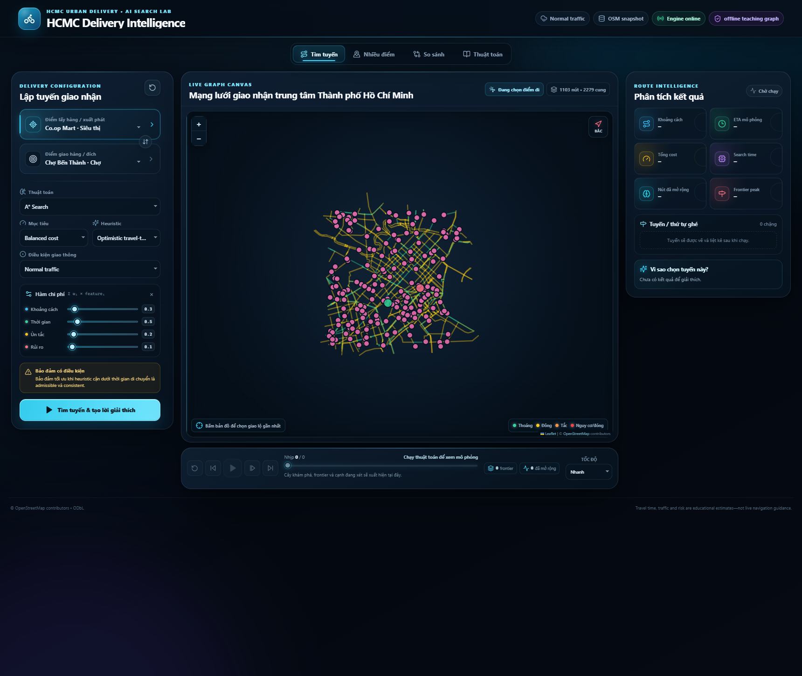
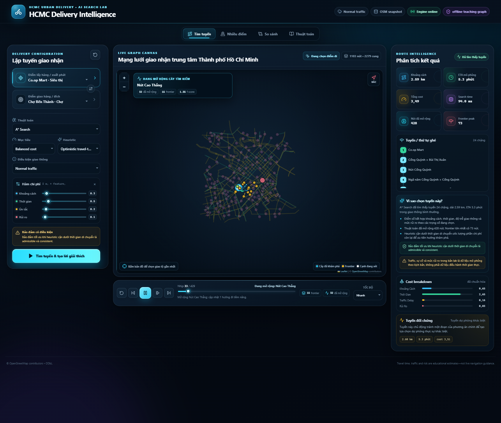
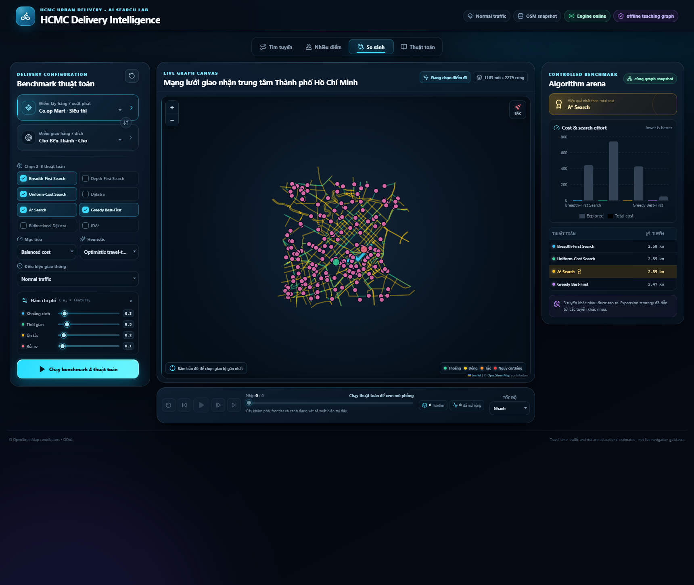
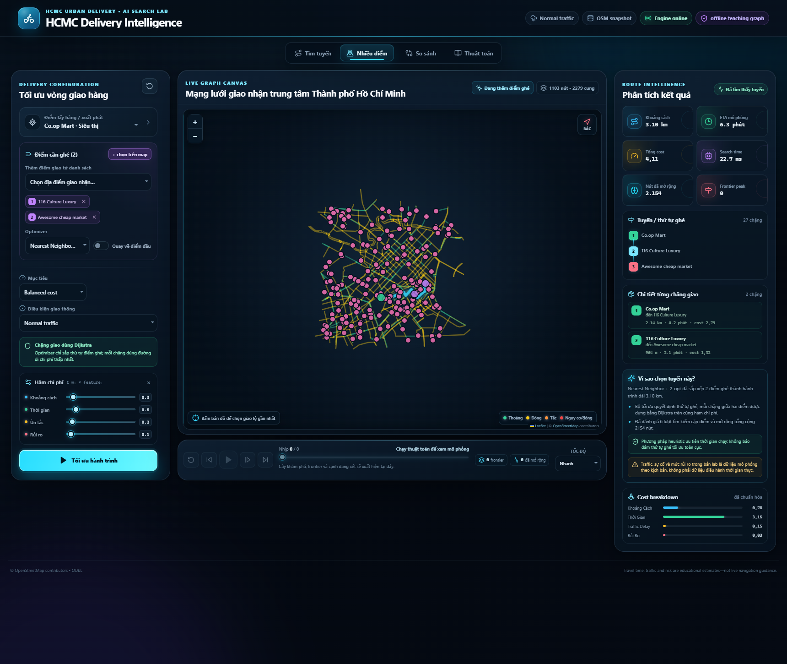
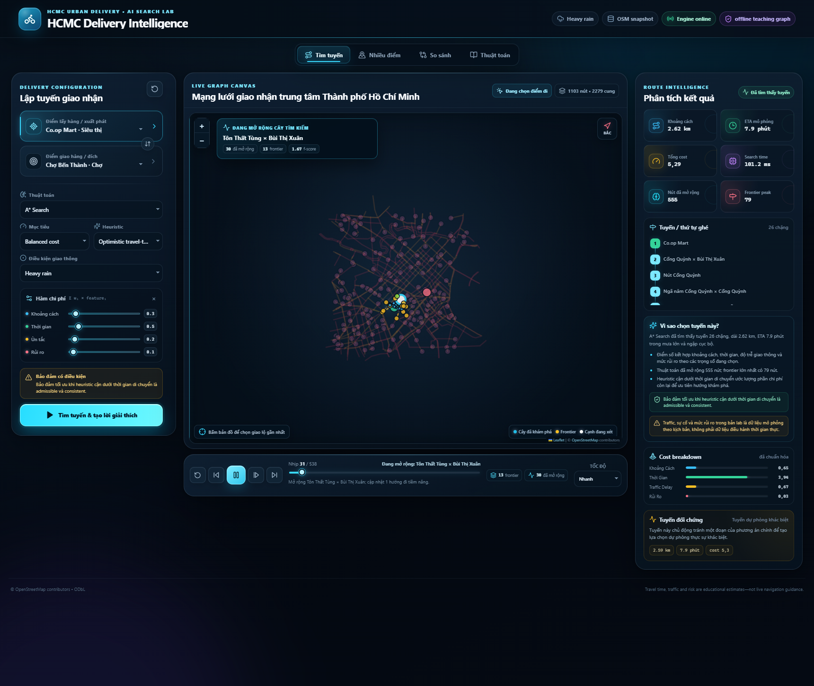
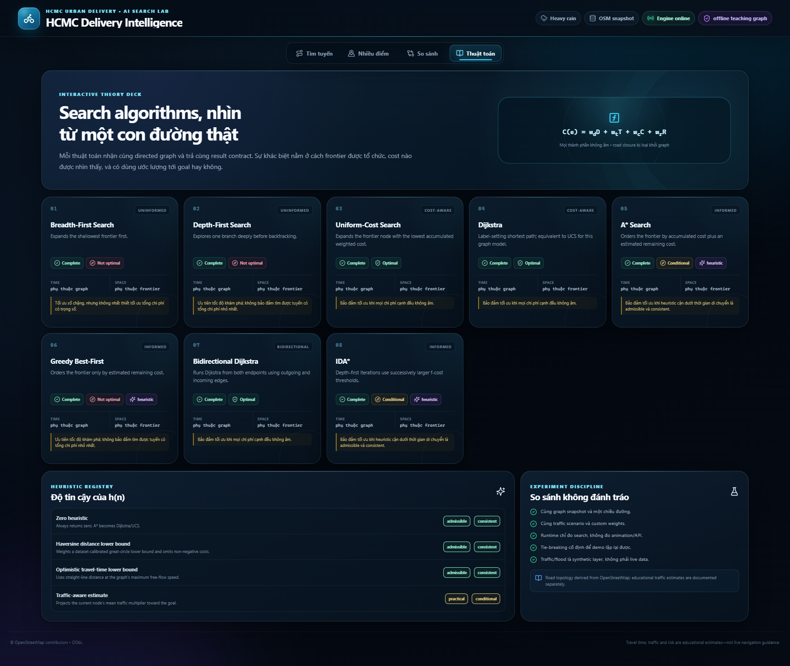

# Báo cáo kỹ thuật — HCMC Delivery Route Intelligence Lab

> Bản nguồn để nhóm hoàn thiện thông tin cá nhân, ảnh chụp và export PDF. Mọi số liệu dataset/benchmark dưới đây thuộc snapshot canonical v2.0.0 hiện tại; không tái sử dụng kết quả của dataset cũ.

## A. Thông tin nhóm

| Trường | Nội dung cần điền |
|---|---|
| Mã nhóm | `[[Group ID]]` |
| Lớp | `[[Class]]` |
| Đại diện | `[[Representative]]` |
| Thành viên | `[[Name — Student ID — contribution]]` |
| Repository/commit nộp | `[[URL — commit SHA]]` |
| Video demo | `[[URL]]` |

Nhóm phải thay toàn bộ placeholder trước khi export bản nộp.

## 1. Tóm tắt dự án

Dự án xây dựng một phòng thí nghiệm tìm đường cho **shipper/courier giao hàng trong khu vực trung tâm Thành phố Hồ Chí Minh**. Người dùng chọn điểm lấy hàng hoặc điểm xuất phát, điểm giao, thuật toán, heuristic, kịch bản giao thông và trọng số mục tiêu. Hệ thống trả tuyến có hướng, các bước mở rộng graph, metric, phân rã chi phí, lời giải thích và một tuyến đối chứng khi tồn tại.

Đề xuất ban đầu dùng Streamlit; theo phạm vi triển khai của nhóm, hệ thống dùng FastAPI cho backend và React/Vite cho frontend localhost. Thay đổi công nghệ không làm đổi trọng tâm của Lab 1: biểu diễn graph, cài đặt thuật toán tìm kiếm, so sánh hành vi và tối ưu thứ tự nhiều điểm giao.

Snapshot canonical hiện có **1.103 node, 2.279 cung có hướng và 187 delivery POI**, vượt yêu cầu tối thiểu khoảng 20 node/30 edge. Dataset lớn hơn mức tối thiểu nhưng UI vẫn tập trung vào search trace và so sánh thuật toán, không tự nhận là ứng dụng bản đồ production.

## 2. Bối cảnh, mục tiêu và ranh giới

### 2.1 Bài toán giao hàng

Trong giao hàng đô thị, tuyến ngắn nhất về kilomet chưa chắc có ETA hoặc tổng chi phí tốt nhất. Đường một chiều, cao điểm, mưa, gián đoạn đường và mức exposure mô phỏng có thể làm hai tuyến gần nhau về hình học khác nhau về weighted cost. Ứng dụng cho phép quan sát sự khác nhau giữa:

- BFS/DFS không dùng weighted cost để chọn frontier;
- UCS/Dijkstra tối ưu cost không âm;
- A*/IDA* kết hợp `g+h` dưới điều kiện heuristic;
- Greedy Best-First ưu tiên `h` nhưng không bảo đảm optimum;
- Bidirectional Dijkstra tìm từ hai đầu trên graph có hướng;
- các phương pháp exact/approximate cho nhiều delivery stop.

### 2.2 Ranh giới bắt buộc

> **Cảnh báo khi demo/báo cáo:** “Topology/tags đến từ snapshot OpenStreetMap. ETA, congestion, road disruption, flood susceptibility và risk là dữ liệu/ước lượng giáo dục deterministic — không phải traffic hay navigation live.”

`traversable=true` chỉ cho phép một cung tham gia **mô hình search**. Nó không xác nhận đường hợp pháp hoặc phù hợp cho xe máy, ô tô, xe tải hay người đi bộ. Dataset không mô hình hóa đầy đủ biển cấm, turn restriction, lane restriction, giờ cấm, công trường và điều kiện hiện trường. Vì vậy không dùng output làm turn-by-turn navigation hoặc quyết định giao vận production.

POI loại `delivery_hospital` chỉ là một category địa điểm giao/nhận trong OSM; ứng dụng không thực hiện điều phối y tế hoặc đánh giá năng lực cơ sở.

## 3. Mô hình hóa bài toán

### 3.1 Directed graph

Ký hiệu graph `G=(V,E)`:

- state là node hiện tại;
- initial state là `start_id`;
- action là đi qua một outgoing edge `u→v` còn traversable;
- transition trả node `v` và cộng edge cost;
- goal test là `node_id == goal_id`;
- solution là ordered node path và ordered edge path.

Node có `id`, `name`, `kind`, `lat`, `lon`, `attributes`. Edge có `source`, `target`, `distance_m`, `speed_kph`, `road_name`, `road_class`, `risk`, `traversable`, `direction`, polyline và provenance.

Mỗi canonical edge đã là một cung có hướng. Với đoạn nguồn gắn nhãn `two-way`, chiều ngược đã tồn tại dưới dạng record khác; loader **không** nhân đôi lần nữa. `direction` giữ nghĩa của đoạn nguồn, còn `source→target` là hướng thật của record runtime.

Edge bị đóng trong scenario hoặc có `traversable=false` bị loại khỏi transition set, không được gán một penalty hữu hạn.

### 3.2 Hàm chi phí

Với weight request `w`, backend chuẩn hóa thành `ŵ` có tổng 1:

```text
C(e) = ŵd × distance_km(e)
     + ŵt × travel_minutes(e)
     + ŵc × delay_minutes(e)
     + ŵr × [risk(e) × distance_km(e)]
```

| Thành phần | Đơn vị trước weighting | Nguồn |
|---|---|---|
| distance | kilomet | source graph/geometry |
| travel time | phút | free-flow speed × deterministic scenario multiplier |
| traffic delay | phút | travel time trừ free-flow time |
| risk exposure | risk fraction × kilomet | source risk chuẩn hóa × quãng đường |

Các thành phần đều không âm. Preset UI:

- Shortest distance: tăng mạnh `distance`;
- Fastest ETA: tăng `travel_time` và `traffic_delay`;
- Balanced: phối hợp đủ bốn thành phần;
- Low risk/Priority delivery là extension dưới dạng weight preset, không phải field API riêng.

Backend nhận `cost_weights`, không nhận một chuỗi `objective` hoặc `vehicle` không có tác dụng.

### 3.3 Scenario giao thông deterministic

| ID | Ý nghĩa |
|---|---|
| `normal` | baseline congestion của snapshot và jitter ổn định |
| `morning_rush` | tăng delay, nhất là major-road approach |
| `evening_rush` | congestion rộng hơn và river-crossing pressure |
| `heavy_rain` | giảm speed theo risk/bridge flags |
| `incident` | road disruption đóng các edge được gắn cờ |

Scenario dùng SHA-256 bucket theo `(scenario, edge_id)`, không dùng random tại request time. Cùng dataset và request tạo cùng multiplier, closure và route, ngoại trừ runtime/UUID.

## 4. Dataset và pipeline chuẩn hóa

### 4.1 Canonical snapshot

| Field | Giá trị |
|---|---|
| File runtime | `backend/data/hcmc_delivery_osm_snapshot.json` |
| Dataset ID | `hcmc-city-centre-delivery-osm-2026` |
| Version | `2.0.0` |
| City | Thành phố Hồ Chí Minh, Việt Nam |
| OSM base timestamp | `2026-08-05T16:31:02Z` |
| Query bbox | `[10.750, 106.665, 10.800, 106.715]` |
| Runtime node bounds | south `10.7483071`, west `106.6614172`, north `10.806955`, east `106.7194435` |
| Road filter | `primary|secondary|tertiary` plus generated service connectors |
| Canonical SHA-256 | `9D803A77A88418A5512F3098D859FD28CBA6539AE92E12D9394EE2E39C8D2A37` |

Runtime chỉ đọc canonical file trong `backend/data`. Thư mục `backend/data-tmp` là workspace import, đã được gitignore và không phải dependency runtime.

### 4.2 Import contract và validation

`scripts/import_hcmc_snapshot.py` đọc processed export và raw Overpass snapshot, sau đó fail-fast nếu gặp schema không an toàn để đoán. Pipeline:

1. xác nhận metadata là Thành phố Hồ Chí Minh và graph đạt minimum Lab;
2. kiểm tra unique node ID, coordinate hợp lệ, endpoint tồn tại và không có self-loop;
3. chuyển `latitude/longitude` thành `lat/lon` và gắn delivery category;
4. chuyển kilomet sang metre; chuẩn hóa risk nguồn `0–5` thành fraction `0–1`;
5. lấy numeric OSM `maxspeed` khi mọi contracted way có tag hợp lệ, nếu không dùng documented class fallback;
6. kiểm tra reconstructed time lệch source không quá `0.01` phút;
7. xác nhận mọi source arc `two-way` có reverse record và không expand lại;
8. tính SCC, đánh dấu primary/peripheral component và ghi source SHA-256/canonical stats;
9. khi runtime nạp canonical file, loader kiểm tra coordinate sequence, anchor và orient geometry theo `source→target`.

### 4.3 Counts và connectivity

| Metric | Giá trị |
|---|---:|
| Raw OSM road ways | 2.008 |
| Contracted road nodes | 916 |
| Delivery POIs | 187 |
| Total canonical nodes | 1.103 |
| Canonical directed arcs | 2.279 |
| Source one-way arcs | 1.039 |
| Source two-way-derived arcs | 1.240 |
| Strongly connected components | 85 |
| Largest/primary SCC | 992 nodes |
| Delivery POIs in primary SCC | 172 |

POI breakdown: 52 hospital-category, 50 supermarket, 40 university, 35 market và 10 bus station. Inclusion chỉ phản ánh OSM tag ở snapshot timestamp.

172/187 POI nằm trong primary SCC; 15 POI còn lại thuộc component ngoại vi. Vì graph có hướng, “gần trên bản đồ” không bảo đảm reachable hai chiều. API phải trả `unreachable`/`multi_route_unreachable` thay vì vẽ một đường thẳng giả.

## 5. Thuật toán tìm đường

| ID | Frontier rule | Weighted? | Guarantee khi không chạm limit |
|---|---|---:|---|
| `bfs` | FIFO, shallowest | no | complete; minimum hops |
| `dfs` | LIFO, deepest | no | complete trên finite graph; not optimal |
| `ucs` | minimum `g` | yes | optimal với cost không âm |
| `dijkstra` | minimum settled label | yes | cùng core/guarantee với UCS trong model này |
| `astar` | minimum `g+h` | yes | optimal với admissible, consistent `h` |
| `greedy_best_first` | minimum `h` | no | complete trên finite graph; not optimal |
| `bidirectional_dijkstra` | hai Dijkstra wave | yes | optimal với cost không âm |
| `ida_star` | iterative DFS theo f-bound | yes | conditional; có thể re-expand rất lớn |

BFS, DFS, UCS và A* là bốn thuật toán bắt buộc. Dijkstra, Greedy, Bidirectional Dijkstra và IDA* là bốn extension. Tất cả trả cùng `SearchResult` và trace schema.

Operational `max_expansions` có thể dừng bất kỳ run nào. Khi đó status là `limit_reached`, không được gọi là `unreachable`.

## 6. Heuristic

Backend tính:

```text
s = min(1, min_edge distance_m(edge) / haversine_m(endpoints))
δ(u,v) = s × haversine(u,v)
```

Snapshot hiện có `s≈0.824833527`, `v_max=70 km/h`. Registry:

| ID | Công thức chính | Admissible | Consistent |
|---|---|---:|---:|
| `zero` | 0 | yes | yes |
| `haversine` | weighted calibrated `δ` | yes | yes |
| `travel_time` | distance + optimistic time ở `v_max` | yes | yes |
| `traffic_aware` | project local mean traffic tới goal | no | no |

Calibrated distance không vượt edge distance; omitted cost components đều không âm. Vì vậy `haversine` và `travel_time` là lower bound cho implemented cost. `traffic_aware` có thể overestimate nên gỡ bỏ A*/IDA* optimality guarantee.

## 7. Nhiều delivery stop

Backend xây directed pairwise matrix bằng exact Dijkstra dưới cùng scenario/weights, rồi tối ưu stop order:

| Method | Exact? | Mô tả |
|---|---:|---|
| Nearest Neighbor | no | chọn stop có pairwise cost nhỏ nhất tiếp theo |
| NN + 2-opt | no | cải thiện greedy order bằng đảo subsequence |
| Held–Karp | yes, ≤10 stops | DP `O(n²2ⁿ)` trên pairwise matrix |
| Seeded SA + 2-opt | no | stochastic reproducible rồi cleanup |

“Held–Karp exact” chỉ đúng cho stop set, return flag, directed pairwise matrix, snapshot, scenario và weights hiện tại, với mọi pair search hoàn tất. Nó không giải quyết vehicle capacity, time window, nhiều shipper hoặc luật lưu thông live.

## 8. Kiến trúc hệ thống

```text
React + TypeScript + Leaflet + Recharts
                  │ REST /api/v1
                  ▼
FastAPI ──► traffic + cost + heuristic registries
                  │
                  ├─ 8 pair-search runners + normalized trace
                  ├─ alternative-route engine
                  ├─ 4 multi-stop optimizers
                  └─ canonical HCMC JSON snapshot
```

Backend không dùng NetworkX cho search. `RoadGraph` giữ outgoing và incoming adjacency để hỗ trợ directed traversal và bidirectional search.

React dùng `GET /graph?compact=true&include_geojson=false`: edge geometry xuất hiện một lần ở `directed_edges[].geometry`, map chỉ nhận attribute cần render và `graph_geojson.features` rỗng. GIS client vẫn có thể chọn `include_geojson=true`. Sau lần tải topology đầu tiên, đổi scenario chỉ gọi `/traffic`, nhận status ngắn theo `edge_id`; Leaflet cập nhật style theo chunk qua `requestAnimationFrame`. Thiết kế này giảm JSON parse/allocation và tránh restyle đồng bộ hàng nghìn layer mà không bỏ polyline hay hiệu ứng.

Frontend có Route, Multi-stop, Compare, Learn, map click/snap, trace playback, current/frontier/explored visualization, metrics, cost breakdown và explanation. Objective trên UI chỉ là weight preset.

## 9. Trace, explanation và tuyến đối chứng

Trace event fields:

```text
step, event, node_id, parent_id, edge_id, direction,
frontier_size, explored_count, g_cost, h_cost, f_cost,
depth, message
```

Frontend reconstruct cây search/frontier link từ event, không chỉ làm một marker nhảy giữa node. Trace cap giới hạn dữ liệu lưu và transfer, không đổi quá trình search.

Explanation tách:

- summary của run;
- optimality đúng theo algorithm/heuristic;
- traffic scenario;
- cost formula;
- warnings về heuristic, truncation và dataset.

Alternative route lần lượt loại từng edge của primary path và chọn candidate Dijkstra tốt nhất. Đây là một phương án đối chứng bounded, không phải full k-shortest hay “second-shortest route”.

## 10. Đánh giá thực nghiệm

### 10.1 Protocol và pair-search case

Số dưới đây được chạy trực tiếp trên canonical snapshot v2.0.0, Windows/Python 3.14, một invocation, không dùng làm kết luận benchmark phần cứng. Input:

```text
start    poi_way_152994798 — Co.op Mart
goal     poi_way_39514795  — Chợ Bến Thành
scenario morning_rush
weights  distance=.25, travel_time=.50, traffic_delay=.20, risk=.05
heuristic travel_time
max_expansions 100000
trace disabled for measurement
```

| Algorithm | Status | Cost | Distance (m) | ETA (s) | Expanded | Generated | Frontier peak | Hops | Runtime (ms)* |
|---|---|---:|---:|---:|---:|---:|---:|---:|---:|
| BFS | found | 5.093109 | 2 500 | 463.925 | 444 | 523 | 87 | 17 | 11.761 |
| DFS | found | 74.836653 | 41 651 | 6 593.769 | 495 | 675 | 190 | 220 | 10.031 |
| UCS | found | 4.781696 | 2 483 | 434.741 | 723 | 843 | 90 | 22 | 8.801 |
| Dijkstra | found | 4.781696 | 2 483 | 434.741 | 723 | 843 | 90 | 22 | 6.701 |
| A* | found | 4.781696 | 2 483 | 434.741 | 470 | 584 | 74 | 22 | 60.019 |
| Greedy Best-First | found | 6.099368 | 3 467 | 541.421 | 50 | 78 | 29 | 29 | 8.163 |
| Bidirectional Dijkstra | found | 4.781696 | 2 483 | 434.741 | 265 | 352 | 67 | 22 | 2.736 |
| IDA* | limit_reached | — | — | — | 100 000 | 151 377 | 25 | — | 15 612.317 |

\* Runtime là một lần chạy; cần warm-up và median/IQR nếu dùng để chấm kết luận performance.

Diễn giải:

- BFS tìm ít hop hơn nhưng cost cao hơn optimum.
- DFS phụ thuộc adjacency order và tạo detour rất lớn.
- UCS/Dijkstra/A*/Bidirectional đồng ý optimum weighted cost.
- A* giảm expansion so với Dijkstra nhưng heuristic computation làm runtime đơn lẻ cao hơn; “fewer expansions” không đồng nghĩa luôn nhanh hơn theo milliseconds.
- Greedy mở rộng ít nhưng route cost cao hơn.
- IDA* chạm operational limit; kết quả này không có nghĩa goal unreachable.

### 10.2 Scenario sensitivity

Dijkstra, cùng start/goal/weights:

| Scenario | Cost | Distance (m) | ETA (s) | Delay (s) | Hops |
|---|---:|---:|---:|---:|---:|
| normal | 3.486893 | 2 588 | 318.508 | 47.627 | 24 |
| morning_rush | 4.781696 | 2 483 | 434.741 | 152.836 | 22 |
| evening_rush | 5.272845 | 2 792 | 466.168 | 197.717 | 28 |
| heavy_rain | 5.289770 | 2 616 | 473.116 | 199.787 | 26 |
| incident | 4.287072 | 2 588 | 387.095 | 116.214 | 24 |

Scenario có thể đổi cả ETA và topology tối ưu. `incident` hiện đóng 47 directed arc được gắn cờ deterministic; việc đóng edge toàn graph không bảo đảm pair cụ thể luôn đổi route.

### 10.3 Multi-stop exact và approximate

Start Co.op Mart; stops Chợ Bến Thành, Chợ Tân Định, Co.opmart Rạch Miễu và Trường Đại học Sài Gòn – cơ sở chính; quay về start; `morning_rush`.

| Method | Cost | Distance (m) | ETA (phút) | Iterations | Improvements |
|---|---:|---:|---:|---:|---:|
| Nearest Neighbor | 27.202982 | 16 057 | 39.783 | 4 | 0 |
| NN + 2-opt | 25.924372 | 15 187 | 37.975 | 10 | 2 |
| Held–Karp | 25.924372 | 15 187 | 37.975 | 48 | 0 |
| Seeded SA + 2-opt | 25.924372 | 15 187 | 37.975 | 1 000 | 2 |

2-opt giảm 4,7003% so với Nearest Neighbor trong case này. Việc 2-opt/SA trùng Held–Karp ở một case không tạo guarantee toàn cục.

## 11. Cài đặt và demo UI

```powershell
powershell -ExecutionPolicy Bypass -File .\scripts\setup.ps1
powershell -ExecutionPolicy Bypass -File .\scripts\start-dev.ps1
```

Mở UI tại `http://localhost:5173`, Swagger tại `http://127.0.0.1:8000/docs`.

Demo đề xuất:

1. chọn Co.op Mart → Chợ Bến Thành, A*, `travel_time`, `morning_rush`;
2. chạy trace và chỉ current/frontier/explored tree;
3. giải thích cost breakdown và điều kiện optimality;
4. Compare BFS, UCS, A*, Greedy trên cùng request;
5. đổi Normal → Heavy Rain để xem sensitivity;
6. Multi-stop với NN, 2-opt và Held–Karp;
7. mở Learn để chỉ heuristic admissibility.

### 11.1 Evidence giao diện



*Route mode trên HCMC snapshot: `poi_way_152994798` Co.op Mart → `poi_way_39514795` Chợ Bến Thành, Normal, weights 0.25/0.50/0.20/0.05. Working tree dựa trên commit `1c0e01e`; nền bản đồ © OpenStreetMap contributors.*



*A* + optimistic travel-time heuristic trên cùng cặp điểm và weights; ảnh thể hiện current/frontier/explored tree, metrics, explanation và tuyến đối chứng. Working tree dựa trên `1c0e01e`; © OpenStreetMap contributors.*



*BFS, UCS, A* và Greedy Best-First trên cùng HCMC graph, Normal scenario và weights 0.25/0.50/0.20/0.05. Working tree dựa trên `1c0e01e`; © OpenStreetMap contributors.*



*Two-opt sắp thứ tự `poi_node_11124634717` 116 Culture Luxury và `poi_node_13531546501` Awesome cheap market từ Co.op Mart; UI giữ hai Dijkstra leg cùng distance/ETA/cost. Normal, weights 0.25/0.50/0.20/0.05; working tree dựa trên `1c0e01e`; © OpenStreetMap contributors.*



*A* cho Co.op Mart → Chợ Bến Thành dưới `heavy_rain`, cùng heuristic/weights; road overlay, ETA, cost và expansion count thay đổi theo scenario deterministic. Working tree dựa trên `1c0e01e`; © OpenStreetMap contributors.*



*Learn view trình bày tám thuật toán, cost model và admissible/consistent status của bốn heuristic; nội dung không phụ thuộc scenario đang hiện ở header. Working tree dựa trên `1c0e01e`; © OpenStreetMap contributors.*

Các ảnh được tạo lại bởi `CAPTURE_DOCS=1 npx playwright test e2e/route-lab.spec.ts`; caption final phải thay `1c0e01e` bằng SHA commit nộp bài nếu repository được commit sau lần chụp.

## 12. Kiểm thử và tái lập

```powershell
powershell -ExecutionPolicy Bypass -File .\scripts\check.ps1
```

Release gate cần xác nhận:

- importer deterministic và canonical checksum đúng;
- node/edge/reference/geometry/direction invariants;
- 8 algorithm trả path hợp lệ hoặc status đúng;
- safe A* đồng ý Dijkstra optimum trên fixture;
- traffic/closure deterministic;
- compact/full graph payload không duplicate sai;
- API validation và error envelope;
- multi exact/approximate behavior;
- frontend build, unit/E2E, responsive layout và browser console sạch.

Không ghi số lượng “passed/coverage” vào bản nộp trước khi chạy lại trên final commit.

## 13. Hạn chế

1. Snapshot bounded chỉ giữ một phần network trung tâm và các road class chọn lọc; hẻm/residential road có thể thiếu.
2. 85 SCC cho thấy graph không fully strongly connected; 15 delivery POI ngoài primary SCC.
3. POI và connector phản ánh dữ liệu/snap tại timestamp, không bảo đảm đúng cổng giao nhận.
4. `traversable` không phải profile pháp lý cho xe máy hay phương tiện khác.
5. Turn restriction, lane, giờ cấm, tải trọng, công trường và thay đổi hiện trường có thể thiếu.
6. ETA/congestion/risk/closure/flood là educational estimate, không live.
7. Weight chưa được calibration bằng telemetry shipper hoặc nghiên cứu vận tải.
8. Alternative route là single-primary-edge exclusion, không phải k-shortest đầy đủ.
9. IDA* có thể chạm expansion limit trên graph lớn.
10. Multi-stop không có capacity, time window, service time hoặc multi-vehicle assignment.
11. Public OSM raster tile là best-effort và phụ thuộc policy/network.

## 14. Hướng phát triển

- nhập feed traffic được cấp phép với timestamp/provenance;
- vehicle profile và legally validated access/turn restrictions;
- map-matching cổng giao nhận;
- time-dependent shortest path;
- k-shortest/Yen cho alternative;
- ALT/Contraction Hierarchies cho graph lớn;
- VRP capacity/time windows/nhiều courier;
- benchmark harness warm-up, repetitions, median/IQR và CSV;
- self-hosted/commercial tile phù hợp nếu deploy.

## 15. Attribution

Map/data: **© OpenStreetMap contributors**, Open Data Commons Open Database License 1.0.

- [OpenStreetMap copyright and license](https://www.openstreetmap.org/copyright)
- [ODbL 1.0](https://opendatacommons.org/licenses/odbl/1-0/)
- [API contract](API.md)
- [Dataset specification](DATASET.md)
- [Algorithm reference](ALGORITHM_REFERENCE.md)
- [Rubric checklist](RUBRIC_CHECKLIST.md)
- [Demo script](DEMO_VIDEO_SCRIPT.md)

OSM/OSMF không bảo trợ dự án này; synthetic overlays do project tạo, không phải dữ liệu do OSM contributors cung cấp.
