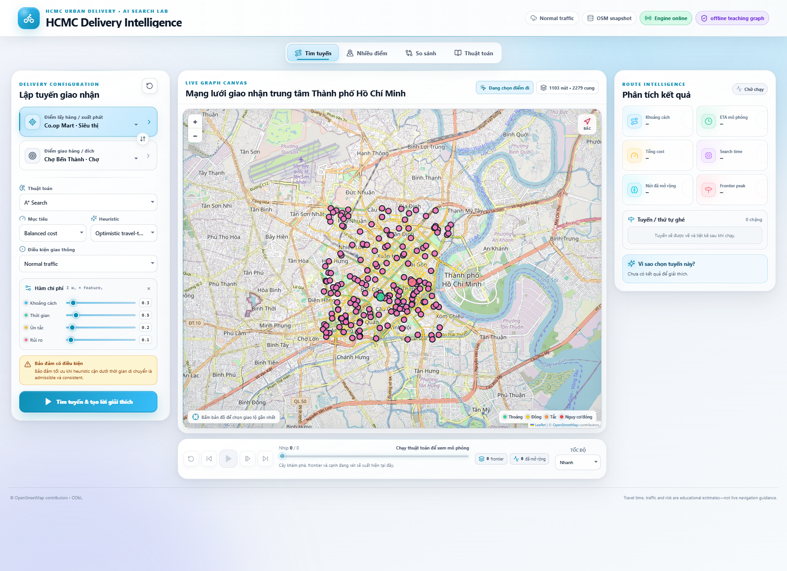
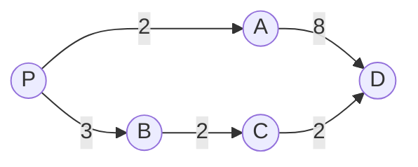
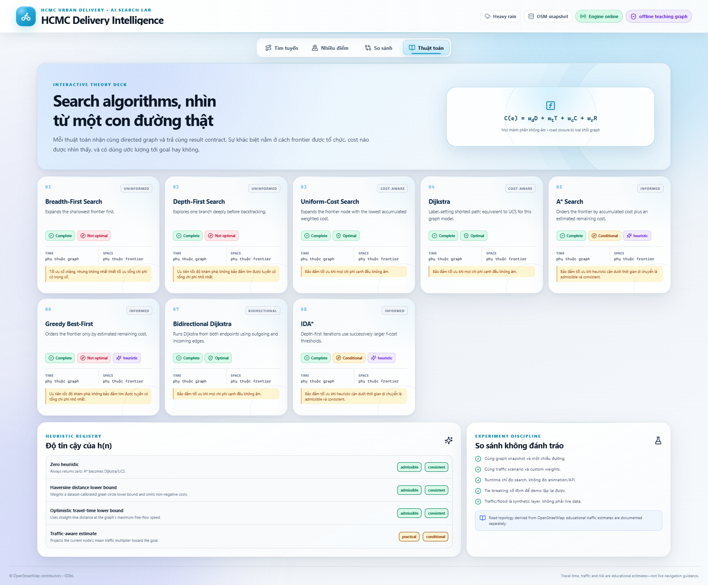
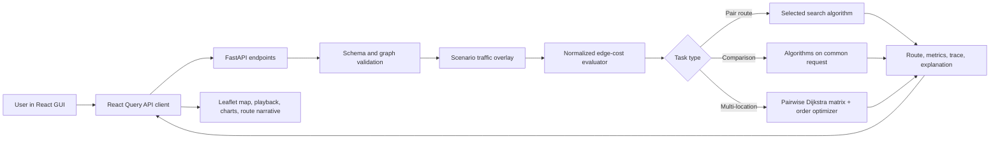
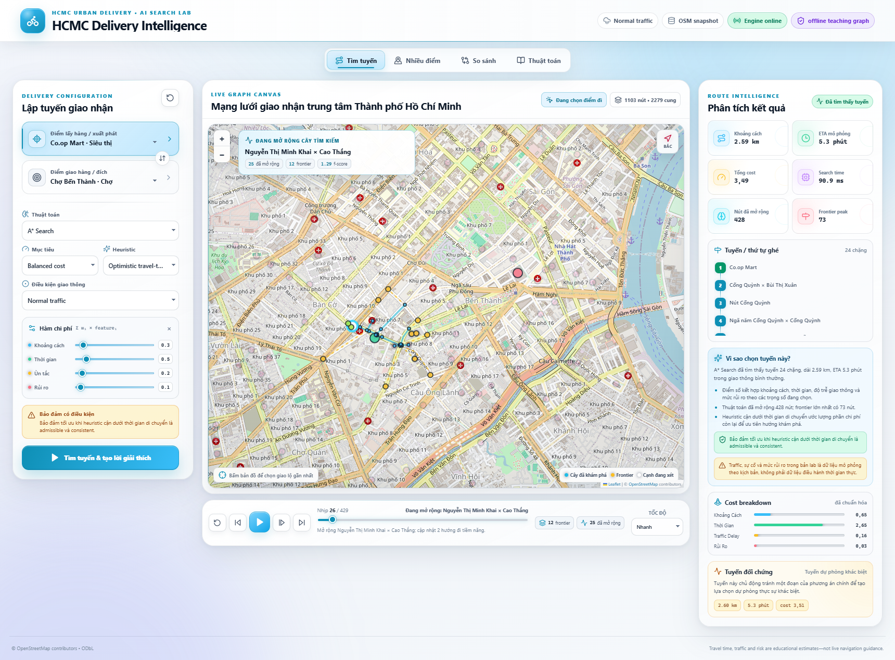
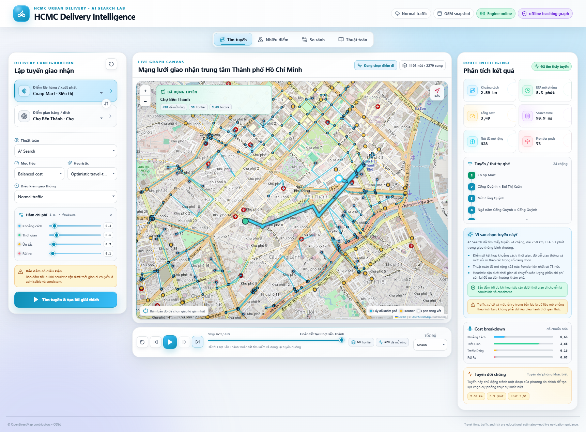
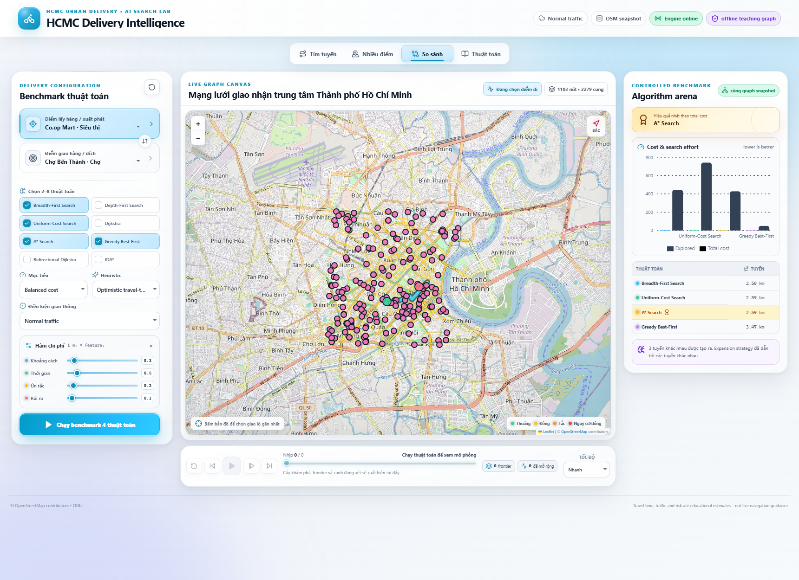
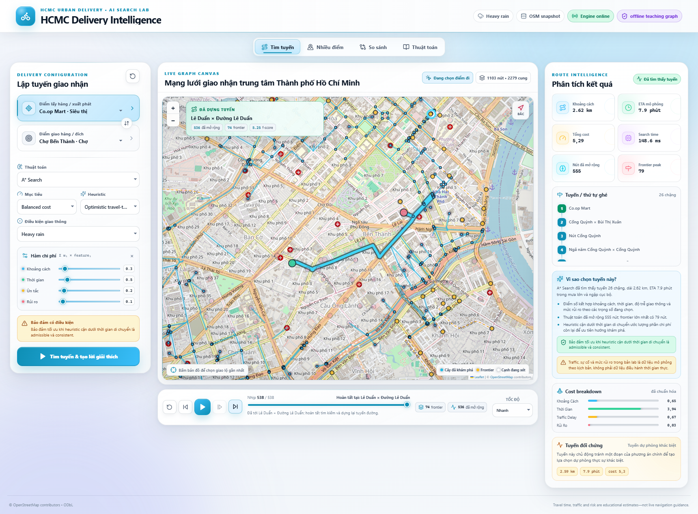
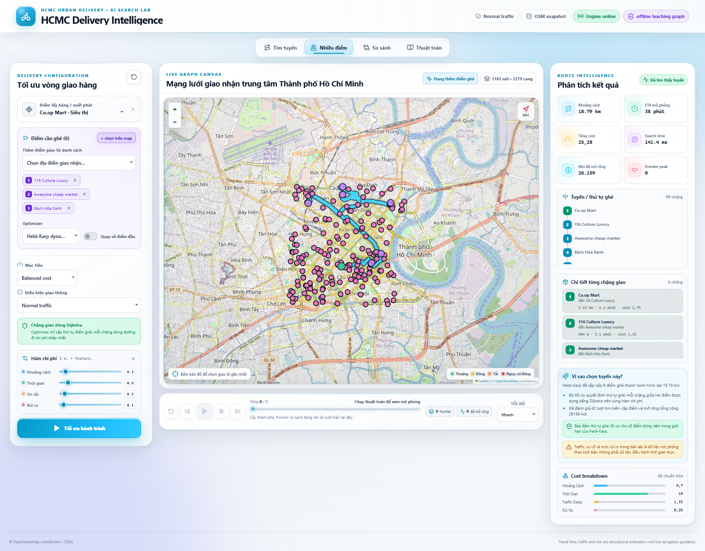

# Technical Report: HCMC Delivery Intelligence

**Coursework:** Lab 1 — Search Strategies  
**System:** A route-search and multi-location planning laboratory for urban delivery in Ho Chi Minh City  
**Report status:** Final version  
**Prepared on:** 12 August 2026  
**Instructor / Supervisor:** Bùi Tiến Lên, Võ Nhật Tân, Bùi Duy Đăng

## 1. Introduction

### 1.1 Project Overview

The project models a last-mile courier or shipper operating in central Ho Chi Minh City. A user selects a pickup point, a delivery destination, an optimization objective, and a traffic condition. The system then searches a road network for a route whose cost reflects distance, estimated travel time, congestion delay, and road risk. A second mode plans an ordered tour through multiple delivery locations.

Figure 1 shows the initial light-theme workspace. Delivery points are drawn over the current OSM basemap, while the left panel defines the problem and the right panel is reserved for the result.



*Figure 1. Initial HCMC delivery workspace. The header identifies the offline teaching graph and engine status; the map reports 1,103 nodes and 2,279 directed arcs. No result metrics are shown before a search is run.*

### 1.2 Group Information and Responsibilities

| Field | Value |
|---|---|
| Group name | `GROUP 6` |
| Class / section | `24C03` |
| Project repository | `https://github.com/AdrianParry-17/AILabProjects` |
| Member 1 | `24127345` — `Nguyễn Minh Đức` |
| Member 2 | `24127346` — `Văn Phú Đức` |
| Member 3 | `24127385` — `Huỳnh Minh Hùng` |
| Member 4 | `24127388` — `Hy Huê Hưng` |

The following contribution matrix reflects the actual work split agreed by the group; every member completed their assigned tasks and contributed equally to the submitted result.

| Member | Primary contribution | Deliverables and verification responsibility | Contribution |
|---|---|---|---:|
| `Nguyễn Minh Đức` | UCS and A* algorithms, GUI development, presentation slides | UCS and A* implementations, shared result contract and trace data, frontend views, slides deck | 100% |
| `Văn Phú Đức` | Cost function, heuristics, DFS, multi-location route optimization, video | Four normalized cost components, heuristic registry with admissibility metadata, DFS implementation, Nearest Neighbor / 2-opt / Held–Karp / Simulated Annealing, demonstration video | 100% |
| `Huỳnh Minh Hùng` | Dijkstra and IDA* algorithms, technical report | Dijkstra and IDA* implementations, bidirectional variant, correctness and complexity analysis, report writing | 100% |
| `Hy Huê Hưng` | Graph data, BFS algorithm, GUI development, technical report | Canonical OSM snapshot and validation, BFS implementation with trace data, React/Leaflet interface, report writing | 100% |

### 1.3 Project Requirements and Completion Status

The completion assessment below refers to observable features in the submitted implementation rather than planned work.

| Requirement | Implemented evidence | Completion |
|---|---|---|
| Vietnamese traffic context | Last-mile delivery planning on a directed Ho Chi Minh City road graph | Complete |
| Graph model and multi-factor cost | 1,103 nodes, 2,279 directed arcs, four normalized cost components | Complete |
| BFS, DFS, UCS, and A* | All four algorithms share one result contract and produce trace data | Complete |
| At least two additional algorithms | Dijkstra, Greedy Best-First, Bidirectional Dijkstra, and IDA* are also implemented | Complete |
| Heuristic explanation | Four selectable heuristics expose admissibility and consistency metadata | Complete |
| Multi-location optimization | Nearest Neighbor, 2-opt, exact Held–Karp, and seeded Simulated Annealing | Complete |
| Interactive GUI | Start/goal/stops, objective, algorithm, heuristic, scenario, weights, map, playback with per-step illustration table, metrics, and explanation | Complete |
| Algorithm comparison | Common-snapshot comparison view plus reproducible backend experiments | Complete |
| Documentation and instructions | This report, figures, setup steps, examples, limitations, and references | Complete |

One operational qualification is important: IDA* is implemented, but the canonical pair benchmark reaches the configured 100,000-expansion safety limit. This is reported as a bounded experimental failure, not presented as a successful route.

## 2. Problem Context

### 2.1 Real-World Delivery Routing Problem

Urban delivery routing is not equivalent to drawing the shortest geometric line. One-way streets constrain direction; bridges and service connectors create bottlenecks; a physically short road may have a low speed or high delay; and the fastest route under normal traffic may become unattractive during a peak period or heavy rain. A courier also faces two related decisions: selecting a path between two places and selecting the order in which several places should be visited.

### 2.2 Motivation for Search-Based Optimization

Route optimization makes these trade-offs explicit. Pair-search algorithms can reduce generalized delivery cost while preserving feasible directed-road transitions. Multi-location optimization can remove unnecessary backtracking from a manually entered visiting order. The interface also exposes explored nodes, frontier size, route quality, and runtime, allowing the same operational problem to serve as a controlled study of AI search behavior.

### 2.3 Intended Use and Interpretation

The application is a teaching and decision-analysis tool rather than an emergency-routing system. Its primary users are students comparing search strategies and delivery planners examining how an objective or congestion assumption changes a route. The road topology comes from an OpenStreetMap snapshot; traffic and risk layers are deterministic educational estimates. Consequently, displayed estimated arrival times must not be interpreted as live dispatch guidance.

## 3. Problem Modeling

### 3.1 Directed Graph Model

The road network is modeled as a directed weighted graph

$$
G=(V,E), \qquad E\subseteq V\times V.
$$

A vertex $v\in V$ represents either a routing intersection, a component gateway, a bridge-access point, or a delivery point snapped to the road network. An arc $e=(u,v)\in E$ represents legal movement from $u$ to $v$. A two-way OSM road is stored as two directed arcs; a one-way road is stored only in its legal direction. Parallel arcs are retained because two road segments can share endpoints while differing in road identity or attributes.

### 3.2 Search State

For pair routing, a search state is the current vertex. The start state $s$ is the selected pickup node and the goal test is $v=g$, where $g$ is the selected delivery node. A transition from $u$ to $v$ is permitted only when a directed outgoing arc $(u,v)$ exists and that arc is open in the selected scenario. The result is an ordered vertex sequence $P=\langle s,\ldots,g\rangle$ and its corresponding arc sequence.

### 3.3 Multi-Location Routing Problem

For multi-location routing, the higher-level state is $(v,S)$: current required location $v$ and the subset $S$ of required locations already visited. The lower-level route between any ordered pair of required locations is computed with Dijkstra on the same directed graph and cost model. This separation makes the visiting-order optimizer independent of the detailed street path while preserving exact shortest paths for every selected leg.

### 3.4 Edge Attributes

Each canonical arc stores or derives the following information.

| Attribute | Meaning and use |
|---|---|
| `source`, `target` | Legal directed transition endpoints |
| Distance | Arc length in metres, calculated from imported road geometry |
| Geometry | Ordered latitude/longitude points used to draw the road and route |
| Road class | `primary`, `secondary`, `tertiary`, or generated `service` connector |
| Speed | Explicit OSM maximum speed where usable; otherwise a documented class fallback |
| Source time | Imported free-flow time when positive; seven zero values use the speed-based fallback |
| Base congestion | Static relative congestion attribute from 1.00 to 4.50 |
| Risk | Non-negative educational exposure coefficient from 0.06 to 0.66 |
| Flags | Bridge, flood-prone, incident-prone, and close-during-incident indicators |
| Direction and provenance | One-way status, OSM identifiers, speed source, and importer metadata |

### 3.5 Traffic Scenario Model

For a selected scenario $q$, the traffic layer computes a deterministic multiplier $m_q(e)\geq1$. Free-flow time is derived from length and speed, after which

$$
t_q(e)=t_{free}(e)m_q(e),\qquad
d_q(e)=t_q(e)-t_{free}(e).
$$

Here $t_q$ is estimated traversal time and $d_q$ is congestion delay. A SHA-256-based edge/scenario key supplies deterministic variation, so repeated experiments on the same snapshot are reproducible. The normal, morning-rush, evening-rush, heavy-rain, and incident scenarios use different base factors. Morning and evening scenarios further penalize major roads; evening traffic also affects bridges; heavy rain scales exposure using the risk attribute and bridge flag; the incident scenario can close flagged arcs. Traffic levels are labeled light at multipliers up to 1.15, moderate up to 1.45, heavy up to 1.80, and severe above 1.80.

### 3.6 Generalized Cost Function

For an open arc, the implemented generalized cost is

$$
C_q(e)=
w_D\frac{D(e)}{1000}
+w_T\frac{t_q(e)}{60}
+w_C\frac{d_q(e)}{60}
+w_R\left(r(e)\frac{D(e)}{1000}\right),
$$

where $D(e)$ is distance in metres, $t_q(e)$ and $d_q(e)$ are seconds, and $r(e)$ is the risk coefficient. The four features are therefore distance in kilometres, travel time in minutes, delay in minutes, and distance-weighted risk exposure. Raw non-negative user weights are normalized to sum to one before evaluation. The backend defaults are

$$
(w_D,w_T,w_C,w_R)=(0.25,0.50,0.20,0.05).
$$

The resulting total is a dimensionless ranking score, not a currency or probability. The selected path minimizes $C_q(P)=\sum_{e\in P}C_q(e)$ for algorithms with the corresponding optimality guarantee. A closed arc has infinite cost and is excluded from valid transitions. This explicit formula prevents the phrase “best route” from being ambiguous: it always means best under the selected scenario and normalized feature weights.

### 3.7 Objective Presets and Weight Normalization

The GUI supplies balanced, distance, time, safety, and priority-delivery presets and also permits manual weights. The presets apply the following normalized weights: balanced $(0.25,0.35,0.25,0.15)$, distance $(1.0,0,0,0)$, time $(0.10,0.55,0.30,0.05)$, safety $(0.15,0.15,0.10,0.60)$, and priority delivery $(0.15,0.45,0.30,0.10)$. A fresh GUI session starts from the backend defaults shown above; re-selecting an objective applies that preset, and manual weight edits switch the objective to custom.

## 4. Dataset

### 4.1 Data Source

The runtime dataset is `backend/data/hcmc_delivery_osm_snapshot.json`, identified as `hcmc-city-centre-delivery-osm-2026`. It was produced from a bounded Overpass/OpenStreetMap snapshot covering latitude 10.750–10.800 and longitude 106.665–106.715. The source snapshot timestamp is 5 August 2026 at 16:31:02 UTC, and the canonical file was generated at 17:35:43 UTC on the same date. OpenStreetMap data is attributed under the Open Data Commons Open Database License (ODbL) [1].

### 4.2 Data Canonicalization

Raw scraped material is staging input only. The application does not read `data-tmp` at runtime. The importer validates references, converts source rows into the canonical schema, preserves legal direction, creates service connectors for snapped points of interest, and records provenance and checksums. This prevents temporary layouts or duplicate raw representations from leaking into the search engine.

### 4.3 Graph Statistics

| Dataset property | Canonical value |
|---|---:|
| Bounding box | 10.750–10.800° N, 106.665–106.715° E |
| Graph vertices | 1,103 |
| Directed arcs | 2,279 |
| Stored OSM road nodes | 916 |
| Delivery points of interest | 187 |
| POIs in primary routing component | 172 |
| Primary-component vertices | 992 |
| Distinct road names | 425 |
| Raw OSM ways represented | 2,008 |
| Source two-way / one-way arc rows | 1,240 / 1,039 |
| Parallel endpoint pairs retained | 4 |
| Geometry coordinate points | 15,556 |

There are 85 strongly connected components. The default location selectors use the 172 delivery POIs in the primary component so a normal endpoint choice is routable in both directions. Fifteen peripheral POIs remain in the canonical dataset for provenance and diagnostics but are excluded from the default selectable set.

### 4.4 Delivery Points and Locations

The 187 delivery POIs comprise 52 hospitals, 50 supermarkets, 40 universities, 35 markets, and 10 bus stations. The primary component contains 47 hospitals, 46 supermarkets, 37 universities, 32 markets, and all 10 bus stations. The controlled pair experiment uses **Co.op Mart · Siêu thị** (`poi_way_152994798`) as its pickup and **Chợ Bến Thành · Chợ** (`poi_way_39514795`) as its goal. The multi-location experiment uses Co.op Mart, Chợ Thị Nghè, Chợ An Đông, Chợ Tân Định, Go! Miền Đông, Chợ Bến Thành, and Chợ Phú Nhuận. These names are retained in Vietnamese because they are place names.

The 15 peripheral POIs are Bệnh viện Bệnh Nhiệt đới, Bệnh viện Chấn thương Chỉnh hình, Bệnh viện Phụ sản Mekong, Bệnh viện Tâm thần TP.HCM, Bệnh viện Đại học Y Dược TP.HCM, Chợ Chiều, Chợ Cô Giang, Chợ Hòa Bình, Basao Grocery, FamilyMart, Basao Stationery, Vive Gourmet, Trường Đại học Luật TP.HCM, UEF, and Đại học Tôn Đức Thắng. The remaining 172 POIs are available through the GUI selectors and map markers; their canonical identifiers, coordinates, categories, and OSM provenance are embedded in the snapshot rather than duplicated manually in this report.

### 4.5 Attribute Distributions

| Quantity | Minimum | Median | Mean | 95th percentile | Maximum |
|---|---:|---:|---:|---:|---:|
| Directed-arc distance (m) | 2 | 128 | 175.44 | 533 | 2,716 |
| Risk coefficient | 0.06 | 0.20 | 0.204 | 0.36 | 0.66 |
| Base congestion | 1.00 | 2.52 | 2.406 | 3.75 | 4.50 |
| Imported source time (min) | 0.00 | 0.22 | 0.299 | 0.91 | 5.43 |

The sum of stored directed-arc lengths is 399.823 km; this is not unique road length because opposite directions are counted separately. Road classes comprise 776 tertiary, 695 primary, 434 secondary, and 374 service arcs. Speeds range from 20 to 70 km/h. Of the 2,279 arcs, 624 use explicit parsed OSM speed data; the remaining values use documented defaults by road class. There are 69 bridge arcs, 167 flood-prone arcs, 170 incident-prone arcs, and 47 arcs that close in the incident scenario.

### 4.6 Dataset Assumptions

Four assumptions bound interpretation of the data. First, the snapshot is static and covers central HCMC rather than the entire metropolitan area. Second, missing speeds use class-based defaults and generated connectors use synthetic service-road values. Third, congestion and risk are scenario features for education, not sensor observations. Fourth, snapping a POI to a road represents access at the generated connector; it does not model building entrances, turn restrictions, vehicle height, or curbside availability.

## 5. Search Algorithms and Heuristics

### 5.1 Search Algorithm Overview

Consider the following small directed graph. Labels are generalized edge costs.



*Figure 2. A teaching graph used to distinguish shallowest path from least-cost path.*

BFS reaches $D$ through $P\to A\to D$ in two arcs but pays cost 10. UCS, Dijkstra, and an admissible A* search return $P\to B\to C\to D$, whose three arcs cost 7. DFS depends on successor ordering and may follow either branch. Greedy Best-First may choose $A$ if its heuristic looks closer to $D$, even though that decision produces the expensive route. Bidirectional Dijkstra grows exact searches from both ends until their lower bounds prove the best meeting path. IDA* performs depth-first passes under successively larger $f=g+h$ thresholds.

### 5.2 Breadth-First Search

BFS maintains a FIFO queue and expands nodes by increasing depth. With a discovered set, it is complete on this finite graph and runs in $O(|V|+|E|)$ time with $O(|V|)$ stored state. It minimizes the number of arcs, not the weighted delivery cost. It is therefore useful as an uninformed structural baseline.

### 5.3 Depth-First Search

DFS uses a LIFO stack and follows one branch before backtracking. The implementation records discovered nodes, so it terminates on the finite snapshot with $O(|V|+|E|)$ traversal work and $O(|V|)$ total stored state. Its first route depends on adjacency order and has no cost-optimality guarantee. DFS illustrates how low scheduling overhead can coexist with poor route quality.

### 5.4 Uniform-Cost Search and Dijkstra

Both variants maintain a min-priority queue keyed by accumulated path cost $g(n)$, relax outgoing arcs, and ignore stale heap entries. For this single-source non-negative graph, they are behaviorally equivalent. With a binary heap their bound is $O((|V|+|E|)\log |V|)$, with linear graph/search storage. Positive traversable costs give completeness and optimality. Separate names are retained because UCS is the AI-search framing and Dijkstra is also used explicitly for multi-stop legs [2].

### 5.5 A* Search

A\* prioritizes $f(n)=g(n)+h(n)$, where $h(n)$ estimates remaining cost. It is complete for this finite positive-cost problem. With an admissible and consistent heuristic, the returned route is optimal; with the traffic-aware heuristic, it becomes a practical but conditionally optimal method. Its worst case remains exponential in solution depth and it can store a large frontier, although an informative lower bound usually reduces expansions. Heap operations lead to the familiar graph-search bound $O((|V|+|E|)\log|V|)$ when each vertex is settled in the consistent case [3].

### 5.6 Greedy Best-First Search

Greedy search orders the frontier using $h(n)$ alone. It often reaches a geographically nearby goal after few expansions, but ignores the cost already paid. On this finite implementation with duplicate control it is complete, while route optimality is not guaranteed. Its worst-case time and memory remain linear in the explored graph plus priority-queue overhead.

### 5.7 Bidirectional Dijkstra

One Dijkstra search follows outgoing arcs from the start while another follows incoming arcs from the goal. The algorithm maintains the best meeting cost and stops when the sum of frontier lower bounds cannot improve it. It has the same worst-case asymptotic class as Dijkstra and higher bookkeeping, but can reduce the effective search radius. Non-negative costs preserve exact optimality on the directed graph.

### 5.8 Iterative Deepening A* (IDA*)

IDA* performs repeated depth-first searches bounded by $f=g+h$. If no solution is found under a threshold, the smallest exceeded value becomes the next threshold. It uses $O(d)$ path memory, where $d$ is search depth, but repeated expansions can make time $O(b^d)$. With positive costs, finite branching, and an admissible heuristic it is complete and optimal in theory [5]. The application adds a 100,000-expansion guard to protect responsiveness, so operational completeness is bounded by that limit.

### 5.9 Heuristic Functions

The registry contains four heuristics. Their metadata is also displayed in the theory view shown in Figure 3.

| Heuristic | Definition and role | Admissible | Consistent |
|---|---|---|:---:|:---:|
| Zero | $h(n)=0$; reduces A* to UCS/Dijkstra | Yes | Yes |
| Haversine distance lower bound | $w_D\,k\,d_H(n,g)$, where $k$ is a dataset-calibrated road-distance lower-bound scale | Yes | Yes |
| Optimistic travel-time lower bound | Distance lower bound plus minimum possible travel minutes at the graph's maximum free-flow speed | Yes | Yes |
| Traffic-aware estimate | Projects the current node's mean outgoing traffic multiplier toward the goal and includes predicted time/delay | No guarantee | No guarantee |

The Haversine distance between two coordinates is

$$
d_H=2R\arcsin\sqrt{\sin^2\frac{\Delta\phi}{2}+\cos\phi_1\cos\phi_2\sin^2\frac{\Delta\lambda}{2}}.
$$

Admissibility means $h(n)\le h^*(n)$, where $h^*$ is the true remaining generalized cost. Consistency additionally requires $h(n)\le C(n,n')+h(n')$ for every transition. The zero and calibrated lower-bound heuristics satisfy both properties. The traffic-aware estimate can overestimate because local congestion may not continue along the best remaining route; it is offered to demonstrate the speed/guarantee trade-off, and the GUI labels its guarantee as conditional.



*Figure 3. Current algorithm reference view. Eight algorithm cards state completeness and optimality conditions, while the heuristic registry separates guaranteed lower bounds from the practical traffic-aware estimate.*

## 6. System Architecture and Program Flow

### 6.1 System Architecture



*Figure 4. End-to-end module interaction. Static topology and scenario traffic are separated so the frontend can reuse the graph while changing an overlay.*

### 6.2 Module Responsibilities

| Layer | Main modules and responsibilities |
|---|---|
| Backend API | `main.py` exposes health, metadata, graph, traffic, search, compare, and multi-route endpoints; `schemas.py` validates strict requests and responses |
| Data/domain | `loader.py` loads and validates the canonical snapshot; `domain.py` defines graph objects and adjacency access |
| Search core | `algorithms.py` implements eight algorithms; `heuristics.py` registers estimates and guarantees; `costs.py` normalizes weights and evaluates arcs |
| Orchestration | `engine.py` creates requests, routes, metrics, traces, alternatives, and explanations; `multi_stop.py` implements order optimizers |
| Traffic | `traffic.py` creates deterministic scenario-specific travel, delay, level, and closure values |
| Frontend state/API | `App.tsx` coordinates modes and queries; `api.ts` maps transport objects into typed UI objects and caches graph/traffic requests |
| Frontend views | `ControlDeck`, `MapStage`, `PlaybackBar`, `InsightsPanel`, `ComparePanel`, and `AlgorithmGuide` implement configuration, visualization, analysis, and theory views |

### 6.3 API and Execution Flow

For a pair request, the backend validates endpoints, algorithm, heuristic, scenario, and weights; creates the selected traffic snapshot; constructs the cost evaluator; executes the algorithm; reconstructs the route; aggregates distance, time, delay, risk, generated nodes, expanded nodes, frontier peak, heuristic calls, and runtime; and returns trace events and a route explanation when requested. Comparison repeats this controlled operation for selected algorithms on the same graph, scenario, endpoints, and weights. Multi-location routing first computes ordered pair costs with Dijkstra, optimizes the high-level visit order, and then concatenates the exact street legs.

## 7. User Interface

### 7.1 GUI-to-Algorithm Interaction

The GUI loads graph topology once, then fetches a much smaller traffic overlay when the scenario changes. A pair search is enabled only after valid endpoints are available. During playback, the map distinguishes expanded nodes, frontier nodes, the currently expanded node, and the reconstructed final path. Road, exploration, and route strokes use rounded, bolder caps so the layers stay legible over the basemap while animating. Back, step, play/pause, final-step, speed, and range controls share one trace index; moving that index updates both the map and status text. The final route stays visually separate from the exploration tree, which prevents a moving point from being mistaken for the complete search process.

### 7.2 Search Trace and Playback

The playback bar also renders a per-step illustration table whose columns follow the selected algorithm. Every row lists the step number, the node currently being expanded, and the frontier queue; UCS, Dijkstra, and Bidirectional Dijkstra add the accumulated cost $g(n)$, Greedy Best-First adds the estimate $h(n)$, and A* and IDA* show $g(n)$, $h(n)$, and $f(n)$ together. The active row highlights in sync with the trace index, so the table doubles as a readable animation of frontier and score evolution.



*Figure 5. Paused A* trace. The map legend identifies the exploration tree, frontier, and current node; the playback bar reports trace progress, cumulative counts, and a per-step illustration table with algorithm-specific columns.*

### 7.3 Route Result and Metrics



*Figure 6. Completed normal-traffic A* route from Co.op Mart to Chợ Bến Thành. The map draws the selected route over explored roads; the result panel shows distance, ETA, generalized cost, runtime, expanded nodes, frontier peak, route steps, explanation, and cost breakdown.*

## 8. Experimental Evaluation

### 8.1 Theoretical Algorithm Comparison

Let $V$ and $E$ denote graph vertices and arcs, $b$ the effective branching factor, and $d$ the solution depth. Complexity entries describe the implemented graph-search form; practical work depends on heuristic quality and tie-breaking.

| Algorithm | Time | Search memory | Complete in this implementation | Cost-optimal |
|---|---|---|---|---|
| BFS | $O(V+E)$ | $O(V)$ | Yes, finite graph | Only for equal arc costs / minimum hops |
| DFS | $O(V+E)$ | $O(V)$ including discovered set | Yes, finite graph | No |
| UCS | $O((V+E)\log V)$ | $O(V)$ search state | Yes, positive costs | Yes |
| Dijkstra | $O((V+E)\log V)$ | $O(V)$ search state | Yes, non-negative costs | Yes |
| A* | Heuristic-dependent; worst exponential | $O(V)$, often frontier-dominated | Yes, positive finite graph | Yes with admissible/consistent $h$ |
| Greedy Best-First | Worst $O((V+E)\log V)$ | $O(V)$ | Yes, finite graph with discovered set | No |
| Bidirectional Dijkstra | $O((V+E)\log V)$ worst case | $O(V)$ across two searches | Yes | Yes |
| IDA* | $O(b^d)$ worst case | $O(d)$ path memory | Theoretical yes; operationally capped | Yes with admissible $h$, absent cap |

### 8.2 Experimental Methodology

All algorithms received the same canonical graph, start, goal, normal-traffic scenario, and backend default weights. A* and heuristic algorithms used the optimistic travel-time lower bound. Traces and alternatives were disabled so timing measured the search engine rather than serialization or animation. After warm-up, the table reports the median of seven local runs on the development workstation. These millisecond values are comparative measurements, not hardware-independent guarantees.

### 8.3 Controlled Pair-Route Experiment

| Algorithm | Found | Hops | Expanded | Generated | Frontier peak | Total cost | Distance (km) | ETA (min) | Median search time (ms) |
|---|:---:|---:|---:|---:|---:|---:|---:|---:|---:|
| BFS | Yes | 17 | 444 | 523 | 87 | 3.7570 | 2.500 | 5.823 | 2.243 |
| DFS | Yes | 220 | 495 | 675 | 190 | 53.4251 | 41.651 | 79.308 | 2.715 |
| UCS | Yes | 24 | 742 | 859 | 89 | **3.4869** | 2.588 | 5.308 | 4.143 |
| Dijkstra | Yes | 24 | 742 | 859 | 89 | **3.4869** | 2.588 | 5.308 | 4.280 |
| A* | Yes | 24 | 428 | 531 | 73 | **3.4869** | 2.588 | 5.308 | 34.273 |
| Greedy Best-First | Yes | 29 | **50** | **78** | **29** | 4.4330 | 3.467 | 6.643 | 4.777 |
| Bidirectional Dijkstra | Yes | 24 | 273 | 365 | 76 | **3.4869** | 2.588 | 5.308 | **1.613** |
| IDA* | No: cap reached | — | 100,000 | 155,629 | 23 | — | — | — | 11,335.096 |

The experiment separates route quality from raw speed. BFS finds the fewest-hop route but costs 7.75% more than the optimum. DFS is computationally quick on this adjacency order yet produces a 41.651 km route, demonstrating that first-found depth-first behavior is unsuitable for weighted delivery routing. Greedy expands only 50 nodes but pays 27.13% more than the optimum. UCS, Dijkstra, A*, and Bidirectional Dijkstra agree on the optimal cost and path. A* expands 42.32% fewer nodes than UCS, but its Python Haversine calculations make measured wall time higher on this graph. Bidirectional Dijkstra gives the best measured combination of exact quality and runtime. IDA* demonstrates its known re-expansion weakness and is stopped by the safety cap.



*Figure 7. GUI comparison mode. The selected algorithms run against one graph snapshot and objective; the winner card and table compare route, ETA, cost, expanded nodes, and runtime without including animation time.*

### 8.4 Traffic Scenario Experiment

The following controlled experiment keeps A*, endpoints, heuristic, and weights fixed while changing only the scenario. Each runtime is the median of five local runs.

| Scenario | Hops | Expanded | Cost | Distance (km) | ETA (min) | Delay (min) | Risk exposure | Median time (ms) |
|---|---|---:|---:|---:|---:|---:|---:|---:|
| Normal | 24 | 428 | 3.4869 | 2.588 | 5.308 | 0.794 | 0.5380 | 38.979 |
| Morning rush | 22 | 470 | 4.7817 | 2.483 | 7.246 | 2.547 | 0.5730 | 42.618 |
| Evening rush | 28 | 513 | 5.2728 | 2.792 | 7.769 | 3.295 | 0.6211 | 44.425 |
| Heavy rain | 26 | 555 | 5.2898 | 2.616 | 7.885 | 3.330 | 0.5436 | 50.328 |
| Incident | 24 | 479 | 4.2871 | 2.588 | 6.452 | 1.937 | 0.5380 | 44.175 |

Normal and incident use the same vertex path in this request because no arc on the selected normal route is closed; the incident multiplier still raises time and cost. Morning rush, evening rush, and heavy rain each produce a different path. Morning rush even selects a shorter 2.483 km path, but its delay makes it more costly than the longer normal route under normal conditions. Heavy rain expands 29.67% more nodes than normal and chooses 26 arcs, reflecting changed edge ordering from rain, bridge, and risk penalties. Therefore congestion affects both route quality and algorithm workload; it is not merely a number added after a geometric path has been chosen.



*Figure 8. Heavy-rain route result. The header and control identify the active scenario; road colors and the selected route are recomputed from that scenario rather than recoloring a previously fixed result.*

## 9. Multi-Location Optimization

### 9.1 Problem Definition

Given start $s$ and required locations $R=\{r_1,\ldots,r_k\}$, the system seeks an order minimizing the sum of directed shortest-path costs between consecutive locations, optionally returning to $s$.

### 9.2 Pairwise Shortest-Path Matrix

It first runs Dijkstra for each ordered pair to build a cost matrix. This design is necessary because the road graph is directed: the best cost from $r_i$ to $r_j$ need not equal the reverse cost.

### 9.3 Ordering Methods

Four order methods are available. Nearest Neighbor repeatedly selects the cheapest unvisited location. Nearest Neighbor + 2-opt reverses subsequences whenever the matrix cost improves. Seeded Simulated Annealing explores swaps probabilistically, is reproducible because its seed is fixed, and finishes with 2-opt. Held–Karp uses dynamic programming over subsets [4]; for the supported maximum of 10 stops, it returns the exact minimum order for the computed pairwise cost matrix. The API allows at most 12 stops for approximate methods.

### 9.4 Controlled Multi-Location Experiment

The original deliberately zig-zagging order was:

`Co.op Mart → Chợ Thị Nghè → Chợ An Đông → Chợ Tân Định → Go! Miền Đông → Chợ Bến Thành → Chợ Phú Nhuận`

It has cost 40.4191, distance 34.192 km, ETA 59.215 minutes, delay 9.607 minutes, and 219 street arcs. All optimized variants used the same normal scenario and default weights; return-to-start was disabled. The pairwise matrix required 42 directed Dijkstra searches.

| Method | Visiting order after Co.op Mart | Cost | Distance (km) | ETA (min) | Hops | Improvement over input | Status |
|---|---|---|---:|---:|---:|---:|---:|---|
| Original | Thị Nghè → An Đông → Tân Định → Go! → Bến Thành → Phú Nhuận | 40.4191 | 34.192 | 59.215 | 219 | — | User order |
| Nearest Neighbor | An Đông → Go! → Tân Định → Phú Nhuận → Bến Thành → Thị Nghè | 25.9322 | 21.328 | 38.327 | 142 | 35.84% | Approximate |
| NN + 2-opt | An Đông → Go! → Bến Thành → Tân Định → Phú Nhuận → Thị Nghè | **24.3626** | **19.302** | **36.304** | **133** | **39.73%** | Approximate |
| Seeded SA + 2-opt | Same as above | **24.3626** | **19.302** | **36.304** | **133** | **39.73%** | Approximate |
| Held–Karp | Same as above | **24.3626** | **19.302** | **36.304** | **133** | **39.73%** | Exact for matrix |



*Figure 9. Multi-location GUI state using Held–Karp. Numbered stop chips define the input set; the map colors each delivery leg; the result panel lists optimized order, per-leg Dijkstra details, total metrics, and the exactness guarantee. The screenshot is a GUI demonstration and is separate from the controlled seven-location table above.*

### 9.5 Comparison and Interpretation

Held–Karp evaluated 480 subset transitions and proves the best visiting order for this directed pairwise matrix. The two approximate improvement methods happen to reach the same solution in this instance, but that equality does not make them exact in general. The observed 39.73% cost reduction is large because the input was intentionally poor; it should not be generalized as an expected improvement for every delivery list.

## 10. Program Installation and Usage

### 10.1 System Requirements and Installation

The supported coursework workflow uses Windows PowerShell, Python 3.13, and a current Node.js/npm installation. From the repository root:

```powershell
powershell -ExecutionPolicy Bypass -File .\scripts\setup.ps1
powershell -ExecutionPolicy Bypass -File .\scripts\start-dev.ps1
```

The setup script installs `backend/requirements.txt` with Python 3.13 and runs `npm install` in `frontend`. The start script launches FastAPI/Uvicorn at `http://127.0.0.1:8000`, waits for `/api/v1/health`, and then starts Vite at `http://localhost:5173`. Interactive API documentation is available at `http://127.0.0.1:8000/docs`. Pressing `Ctrl+C` in the startup terminal stops the development session.

### 10.2 Manual Startup

For manual startup in two terminals:

```powershell
# Terminal 1
Set-Location backend
py -3.13 -m uvicorn app.main:app --reload --host 127.0.0.1 --port 8000

# Terminal 2
Set-Location frontend
npm run dev -- --host 127.0.0.1
```

### 10.3 Pair-Route Usage

For a pair route, open **Tìm tuyến**, select or click a pickup and destination, choose an algorithm, objective, heuristic, and traffic scenario, adjust weights if required, and run the search. Use the playback bar to return to the beginning, move one expansion backward or forward, play/pause, jump to the final path, change speed, or drag the trace slider; its illustration table shows every recorded step with the frontier queue and, when relevant, the $g(n)$, $h(n)$, and $f(n)$ scores of the algorithm in use. Read the right panel for route metrics, expanded nodes, frontier peak, step list, explanation, component costs, and alternative route.

### 10.4 Algorithm Comparison Usage

For a controlled comparison, open **So sánh**, select at least two algorithms, retain identical endpoints/scenario/weights, and run the benchmark. Open **Thuật toán** to review guarantees before interpreting results.

### 10.5 Multi-Location Usage

For a delivery tour, open **Nhiều điểm**, add stops from the list or map, select an optimizer and optional return-to-start, and run. Held–Karp should be used when an exact answer is required and there are at most 10 stops; approximate methods support up to 12.

### 10.6 Example Input and Output

| Input field | Example |
|---|---|
| Start | Co.op Mart · Siêu thị |
| Goal | Chợ Bến Thành · Chợ |
| Algorithm | A* Search |
| Heuristic | Optimistic travel-time lower bound |
| Objective | Balanced cost |
| Scenario | Normal traffic |
| Backend weights | distance 0.25, time 0.50, congestion 0.20, risk 0.05 |

The controlled backend output is a 24-arc route with generalized cost 3.4869, distance 2.588 km, ETA 5.308 minutes, 428 expanded nodes, and frontier peak 73. Small runtime differences between the table, API, and screenshot are expected because they were captured in separate processes and the interactive request includes trace/result preparation. Route cost and geometry remain deterministic for an identical dataset, scenario, request, and implementation. To reproduce these figures, either call the API without weights (backend defaults) or set the manual weights above; selecting the GUI "Balanced cost" preset applies 0.25 / 0.35 / 0.25 / 0.15 instead (Section 3.7), which changes the scores and route.

## 11. Limitations

### 11.1 Dataset Limitations

The largest data challenge was converting externally scraped OSM-derived material into a stable runtime graph without depending on temporary files. Directionality, parallel arcs, missing speeds, POI snapping, disconnected components, and Unicode place names all required explicit validation. The canonical graph still contains 85 strongly connected components; restricting normal selectors to the primary component improves usability but leaves peripheral places unavailable for ordinary routing.

### 11.2 Traffic and Risk Model Limitations

The cost model is transparent but simplified. Its normalized weighted sum mixes kilometres, minutes, delay minutes, and risk exposure into a ranking score whose interpretation depends on user weights. Risk and scenario congestion are synthetic. Turn delays, signal phases, time windows, parking, vehicle restrictions, delivery service time, and uncertainty are absent.

### 11.3 Search Algorithm Limitations

Haversine lower bounds are mathematically useful but incur noticeable Python computation at this graph scale; the benchmark shows fewer A* expansions without a lower measured runtime. IDA* is especially sensitive to repeated expansion and reaches the operational cap on the canonical request.

### 11.4 Multi-Location Optimization Limitations

The multi-location model optimizes one vehicle and assumes every pairwise leg cost is static during the tour. Held–Karp is exponential in the number of stops and is therefore capped at 10; approximate methods do not prove global optimality.

### 11.5 Frontend and Performance Limitations

The frontend renders a large interactive Leaflet road layer and trace; although topology reuse and batched playback improve responsiveness, performance still depends on browser graphics, display resolution, and dataset size. Live OSM tiles also require network access even though search topology is local.

## 12. Future Work

### 12.1 Data, Traffic, and Cost Model Improvements

The next data revision should integrate timestamped, licensed traffic observations and quantify prediction error against held-out trips. A production map service could add geocoding, turn restrictions, elevation, verified speeds, and map matching while preserving an offline snapshot for reproducible experiments. The cost model could support delivery time windows, driver shifts, tolls, emissions, uncertainty intervals, and learned risk calibration.

### 12.2 Algorithmic and Evaluation Improvements

Algorithmically, contraction hierarchies or multi-level Dijkstra could accelerate pair queries; landmark-based ALT heuristics could reduce A* work while preserving admissibility; and multi-vehicle routing could introduce capacity, depot, fairness, and time-window constraints. Larger stop sets would benefit from branch-and-bound bounds, adaptive large-neighborhood search, or vehicle-routing solvers with explicit optimality gaps. Evaluation should then use repeated cross-scenario trials, route-overlap measures, statistical confidence intervals, memory profiling, and comparisons against a documented operational baseline.

## References

1. OpenStreetMap contributors, “Copyright and License,” OpenStreetMap Foundation, ODbL 1.0. <https://www.openstreetmap.org/copyright>
2. E. W. Dijkstra, “A Note on Two Problems in Connexion with Graphs,” *Numerische Mathematik*, vol. 1, pp. 269–271, 1959. <https://doi.org/10.1007/BF01386390>
3. P. E. Hart, N. J. Nilsson, and B. Raphael, “A Formal Basis for the Heuristic Determination of Minimum Cost Paths,” *IEEE Transactions on Systems Science and Cybernetics*, vol. 4, no. 2, pp. 100–107, 1968. <https://doi.org/10.1109/TSSC.1968.300136>
4. M. Held and R. M. Karp, “A Dynamic Programming Approach to Sequencing Problems,” *Journal of the Society for Industrial and Applied Mathematics*, vol. 10, no. 1, pp. 196–210, 1962. <https://doi.org/10.1137/0110015>
5. R. E. Korf, “Depth-First Iterative-Deepening: An Optimal Admissible Tree Search,” *Artificial Intelligence*, vol. 27, no. 1, pp. 97–109, 1985. <https://doi.org/10.1016/0004-3702(85)90084-0>
